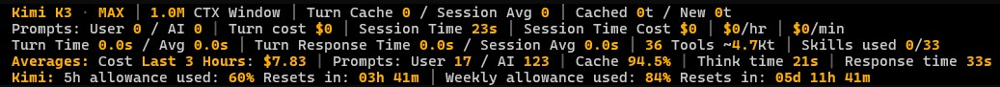

# pi-aftc-toolset

[](https://github.com/DarceyLloyd/pi-aftc-toolset/releases/latest)
[](./LICENSE)

The `pi-aftc-toolset` is a productivity toolset for the [pi](https://pi.dev) CLI coding agent.

This is a collection of tools for which assist with what I do on a daily basis to help get the most out of AI models.

## Footer Widget Preview


---

### Model Evaluations
Click [here](#model-findings) to read my evaluation/findings/experience has been with various AI models (Kimi K3, GLM 5.2, Minimax M3, Qwen 3.7 MAX etc)

---

## Updates v1.8.x

- **v1.8.2 — Footer line 5 now supports Kimi for Coding.** With Kimi as the active model, the footer shows your 5-hour and weekly Kimi subscription usage with live reset countdowns (the same numbers kimi.com shows), refreshed after each prompt and every few minutes during long-running ones. Also: `/ssh-status` now prints a one-line status instead of opening a panel, and the `/ssh-shell` terminal now adapts hard-to-read colours for its dark background (dark blue `ls` listings are brightened, light status bars become dark with white text).
- **v1.8.1 — Packaging/data hygiene.** The whole `.pi-aftc-toolset/` runtime data dir is now hard-excluded from git and npm with no exception rules (a previous exception pattern leaked `config.json` and dev artifacts into the npm tarball). All runtime files are created lazily from in-code defaults. Documented permanently: updating the extension = fresh install (pi replaces the package dir, so extension data is reset by design). Added `tests/install-test` (clean-room Docker verification of the npm install/update lifecycle) and hardened `tests/npm-package-check` to fail if any data-dir, `.pi`, or test path ever ships.

- **AFTC UI suite — replacement for user input screens.** now ships the full interactive layer, I was fed up of pi's dialogues appearing in the middle of the terminal which were hard to read and hard to distinguish the difference between the TUI output and the dialogue modal.
- New bundled `ssh` skill. Load it with `/skill:ssh` for full model-facing guidance on driving the SSH feature from inside pi: routing non-interactive commands to `ssh_run`, interactive programs (Nano, Vi, htop, tmux) to the PTY shell tools, file work to the SFTP tools, and the privacy model that keeps credentials and endpoints out of the model context.
- **New fully featured SSH capabilities (with sftp)** - A packaged Paramiko carrier talks JSON-RPC over local stdio with no socket, HTTP service, or GUI bridge. Capabilities:
  - Multiple simultaneous in-memory connections; password and private-key (including encrypted-key) authentication; session-only host-key approval.
  - Non-interactive commands with bounded standard input; interactive PTY shells (Nano, Vi, htop, tmux) through a local terminal overlay and model tools.
  - Recursive SFTP upload and download with optional `--preserve`, chunked and cancellable transfers with live progress; remote list, stat, read, write, mkdir, rename, and remove.
  - Local (-L), remote (-R), and dynamic SOCKS5 (-D) port forwarding, local-command-only so endpoints stay out of the model context.
  - Credential isolation: the model only ever sees opaque session and shell ids; credentials are memory-only and cleared after each attempt; all output is bounded and redacted; saved records hold non-secret metadata only.
  - built, tested on Windows and Linux against a Docker OpenSSH fixture, and integrated. (I don't have a mac).
- **Deleted all SSH features** Yep, they are gone, in the bin. But a new one is coming, see above...
- **Restored the subscription-allowance footer line** a Pi compatibility regression in optional credential metadata handling broke some things it should now work again for zai, minimax and gpt subscriptions.
- **

---

## Install

### Option 1 - npm (recommended)

```bash
pi install npm:pi-aftc-toolset
```

Then in pi:

```text
/aftc-install     # installs better-sqlite3 + packaged SSH carrier deps (python)
/reload
```

> **Runtime dependencies:** `pi install` does not install all the required runtime deps. Run `/aftc-install` after extension installation.

### Option 2 - GitHub

```bash
pi install git:github.com/DarceyLloyd/pi-aftc-toolset
```

Then in pi:

```text
/aftc-install     # installs better-sqlite3 + packaged SSH carrier deps (python)
/reload
```

> **Runtime dependencies:** `pi install` does not install all the required runtime deps. Run `/aftc-install` after extension installation.

---


## Footer widget


A 4-5 line diagnostic panel (not pi's footer), so it composes alongside other footer/status-bar extensions instead of replacing them. Updates live from pi events and a 1 Hz session sampler. Line 5 (subscription allowance) only appears for providers that expose usage data.

### Line 1 — what's happening right now

Reading left to right:

- **`model` `·` `THINKING`** — which AI model you're using, and the thinking level you set (e.g. `HIGH`).
- **`CTX Window (X%)`** — how big the model's memory is (e.g. `1.0M`), and the `(X%)` is how full that memory is right now. Same number pi shows at the bottom of the screen.
- **`Turn Cache X% / Avg Y%`** — how much of your prompt the model got to reuse from its cache this turn, and your session average. Higher = cheaper.
- **`Cached A / New B`** — of all the stuff you sent this session, how much was cached (`A`) vs sent fresh (`B`).
- **`Tk ↑P Tk ↓Q`** — total tokens sent up to the AI (`P`) and received back (`Q`) this session.

Units: `t` = tokens, `Kt` = thousand tokens, `M` = million tokens (only used for the context window size).

### Line 2 — your money and prompts

- **`Prompts: User N / AI N`** — how many prompts you sent vs how many the AI kicked off on its own (e.g. tool-call follow-ups).
- **`CTX Time`** — how long this session has been alive (e.g. `2h 14m`).
- **`Turn cost`** — what the last prompt cost in dollars.
- **`CTX Time Total Cost`** — what the whole session has cost so far.
- **`$/hr`** and **`$/min`** — how fast you're spending (based on the session clock).

### Line 3 — speed and tools

- **`Turn Time L / Avg A`** — how long the last prompt took (`L`) vs your session average (`A`).
- **`Turn Response Time L / Avg A`** — total round-trip time, last vs average.
- **`N Tools ~X.XKt`** — how many tools the AI can call, and roughly how many tokens they take up in the prompt.
- **`Skills used/avail`** — how many skill files you've loaded this session, out of how many exist (only shown if at least one is loaded).

### Line 4 — long-term averages

Shows your averages over a time window you pick with `/aftc-set-costs-timeframe` (default: last 3 days). Updates from a SQLite log on your disk. Use `/aftc-set-costs-timeframe` to adjust time frame window.

- **`Cost <window>: $X.XX`** — total spend in that window.
- **`Prompts: User X / AI Y`** — prompt counts in that window.
- **`Cache X%`** — average cache hit rate in that window.
- **`Think time X`** and **`Response time X`** — average speeds in that window.

### Line 5 — subscription quota (some providers only)

Only shows up for providers that publish a usage endpoint (openai-codex, MiniMax, Z.ai, Kimi for Coding, Anthropic OAuth).

- **`5h Allowance used: X% Resets in: ...`** — your 5-hour rolling quota.
- **`Weekly Allowance used: Y% Resets in: ...`** — your weekly quota.

--- 


## SSH

The old SSH GUI and features are gone, a new more fully features SSH feature has been build and tested from the ground up windows first and then for linux (I don't have a mac, so lets hope the linux testing gets it working for the OSX peeps).

Connect to remote machines over SSH from inside pi - run commands, open interactive shells (Nano, Vi, htop, tmux), transfer files, manage remote files, and open port forwards. The feature runs a packaged Paramiko carrier as a local process that talks JSON-RPC over its own standard input and output; it never opens a listening socket, an HTTP service, or a local GUI bridge. It supports multiple simultaneous in-memory connections, password and private-key (including encrypted-key) authentication, host-key approval, non-interactive commands with bounded standard input, recursive SFTP transfers, remote file operations, interactive PTY shells, and local (-L), remote (-R), and dynamic SOCKS5 (-D) port forwarding.

> **The AI model is never given any SSH connection details.** Every connection is authorised and opened locally. The model can connect to server by connection name - connection details are stored in a json file and only read by typescript functions and the python sidecar, it is never given to the AI model. The AI model never sees usernames, hosts, ports, passwords, private-key paths, passphrases, fingerprints, or forwarding endpoints. All command output, file content, carrier errors, and stderr are bounded and redacted before they reach the model. Passwords and key passphrases live in memory for a single connection attempt and are cleared immediately afterwards.

### Ensure dependencies are installed

SSH needs native runtime dependencies that `pi install` does not always set up:

- **Python 3** (`py`/`python` on Windows, `python3`/`python` elsewhere) - runs the packaged carrier.
- **uv** - the carrier's package manager. `/aftc-install` uses the platform-native `uv.exe` on Windows and `uv` elsewhere.
- **The packaged carrier environment** - installed via `uv sync --locked` against the carrier shipped inside the package.
- **better-sqlite3** - installed via `npm install` (shared with the usage feature).

Run it once after install:

```text
/aftc-install
/reload
```

`/aftc-install` checks for Node, Python, and uv, reports platform-specific recovery guidance if any are missing, and verifies the carrier with the same ready handshake the runtime uses. npm installs run the post-install hook automatically; **GitHub and local-clone installs skip it, so `/aftc-install` is required for SSH**. See [Dependency installer](#dependency-installer) for the full list. The footer works without these dependencies, but SSH (and usage recording/reporting) do not.

### SSH commands

Every SSH command is local - it runs against a session you authorised yourself. `/ssh-help` shows the same reference inside pi.

| Command | What it does |
| --- | --- |
| `/ssh-cm` | Full-screen connection manager: add / edit / delete saved connections |
| `/ssh-connections` | List your locally saved connection names |
| `/ssh-connect [name]` | Connect to a saved connection (by name or picker) |
| `/ssh-auto-accept-session-on` | Auto-approve new SSH host keys (saved in ssh.json) |
| `/ssh-auto-accept-session-off` | Ask before trusting new SSH host keys (default) |
| `/ssh-status` | Show `SSH Status: Connected to <name>` or `SSH Status: Not connected` |
| `/ssh-select [id]` | Choose the active session used by local SSH commands |
| `/ssh-shell` | Open a full-screen interactive terminal on the selected session |
| `/ssh-close-shell <id>` | Close an interactive shell |
| `/ssh-interrupt <id>` | Send recovery keys (Ctrl+C / Ctrl+D) to a shell |
| `/ssh-upload <local> <remote>` | Upload a file (`--preserve` keeps remote attrs) |
| `/ssh-download <remote> <local>` | Download a file (`--preserve` keeps local attrs) |
| `/ssh-rename <from> <to>` | Rename a remote path (asks for confirmation) |
| `/ssh-disconnect [id]` | Disconnect an SSH session |
| `/ssh-help` | Show the SSH workflow reference |

Running commands, inspecting and changing remote files, and driving
interactive programs are the model tools' jobs — ask the model and it uses
`ssh_run`, `ssh_read_file`, `ssh_write_file`, and friends. Port forwarding
has no user or model surface; use `ssh -L` / `-R` / `-D` from your own
terminal when you need a tunnel.

### How to manage connections

Saved connections are local metadata only - a name you choose, plus the non-secret connection details (username, host, port, timeout, an optional private-key path, and an optional saved password). They live in `.pi-aftc-toolset/data/ssh.json`, which is excluded from git and npm publishing.

Run `/ssh-cm` (or `/ssh-connection-manager`) to open the full-screen connection manager. The bottom options row offers **Add new connection**, **Edit**, and **Delete** for the highlighted entry (Tab moves between the list and the options, Left/Right moves between options, Enter activates):

- **Add** opens the new-connection dialog (validation, empty-password and name-collision confirms).
- **Edit** opens the same form pre-filled; a saved password is kept, and renaming through the name field removes the old record.
- **Delete** asks "Are you sure?" before removing the record (a live session started from it keeps running).

Saved connections are created in the connection manager (`/ssh-cm`).

### How to connect

Run `/ssh-connect` (or `/ssh-connect <name>` to jump straight to one). With no name it lists your saved connections — connect-only; new connections are made in `/ssh-cm`. With none saved it points you there. A connection with a saved password connects immediately; otherwise you enter the password or key passphrase for that attempt (never stored, never shown to the model). On the first connection to a host you approve its key locally (or skip the prompt with `/ssh-auto-accept-session-on`) without the fingerprint ever reaching the model; a changed key is rejected by default. Credentials are held in memory for that one attempt and cleared immediately afterwards - including through the new-host approval retry. Several connections and shells can be open at once; their names and opaque ids are tracked only in memory and clear on reload, new session, resume, or exit.

### How to disconnect

`/ssh-disconnect` closes the active session (or `/ssh-disconnect <id>` a specific one); the model can call `ssh_disconnect` with an opaque id. Disconnecting clears the session's redaction boundary, closes its shells and forwards, and stops anything it owned.

The carrier is lazy and self-cleaning. It starts on first SSH use and, once the last session disconnects (or is lost), a short TS-side grace window stops it; if pi is killed or wedged, the sidecar self-exits on a closed stdin pipe and, as a last resort, an idle watchdog (10-minute default, overridable with `AFTC_SSH_IDLE_TIMEOUT_SEC`) closes it. The next connect relaunches a fresh sidecar through the same path.

### Run commands and pick a session

`/ssh-status` shows whether you are connected, and to which server. `/ssh-select [id]` sets which session local commands (`/ssh-shell`, transfers) act on. Running remote commands is a model tool job: ask the model and it uses `ssh_run`, which reports exit code, stdout/stderr presence, and truncation; large output is also written to a local redacted file you can inspect.

### Interactive shells

`/ssh-shell` opens a full-screen interactive terminal (TUI only) attached to the selected session: the remote terminal renders inside the AFTC takeover frame through a built-in virtual screen, so cursor-addressed programs (Nano, Vi, htop, top, less) display properly. It forwards normal text, Enter, Tab, arrows, function keys, Ctrl combinations, bracketed paste, resize, and interrupt. Press **Ctrl+]** to leave the terminal locally without sending that chord to the remote host. `/ssh-close-shell <id>` closes a shell and `/ssh-interrupt <id>` sends it recovery keys (Ctrl+C / Ctrl+D).

### Transfer files

`/ssh-upload <local> <remote>` and `/ssh-download <remote> <local>` move files with local overwrite confirmation. Both support an opt-in `--preserve` flag that restores remote timestamps and permission bits on upload, and local timestamps (plus permissions on POSIX hosts) on download; it is off by default. Transfers run in chunks so a large transfer can be cancelled mid-flight - aborting stops the carrier and removes its temporary file, leaving nothing behind.

### Manage remote files

Remote file work is a model tool job: the model uses `ssh_list_dir`, `ssh_stat`, and `ssh_read_file` to inspect, and `ssh_write_file`, `ssh_mkdir`, `ssh_rename`, and `ssh_remove` to change — every remote-mutating operation requires explicit local-user confirmation. The one remaining user command, `/ssh-rename <from> <to>`, renames a remote path after confirmation. Large reads are also saved to a local redacted file so you can inspect the full content without it entering the model context.

### Model tools

The model can help with SSH work through opaque session and shell ids. It can connect and reconnect a saved server by name and disconnect when done, but it can never create, edit, or delete a connection and never sees host, user, port, key path, password, passphrase, or fingerprint data.

- `ssh_status`, `ssh_connect`, and `ssh_disconnect` manage the connection surface. `ssh_connect(<name>)` connects a saved server (or returns the existing opaque id if already connected); a local prompt collects credentials each time and the model supplies none. It throws for an unknown name and never offers to create one, and fails safely in headless mode.
- `ssh_run` runs non-interactive commands with bounded standard input.
- `ssh_open_shell`, `ssh_send_keys`, `ssh_paste`, `ssh_resize`, `ssh_peek`, `ssh_interrupt`, and `ssh_close` drive interactive programs such as Nano and Vi.
- `ssh_upload`, `ssh_download`, `ssh_list_dir`, `ssh_read_file`, `ssh_stat`, `ssh_write_file`, `ssh_mkdir`, `ssh_rename`, and `ssh_remove` support file administration; the destructive ones require local-user confirmation.

Every tool result is bounded and redacted. The only connection-level model tools are `ssh_status`, `ssh_connect`, and `ssh_disconnect`; no model tool can create, save, edit, rename, or forget a connection.

### Credential isolation

- Saved connection records contain only local connection metadata. Passwords and key passphrases are never persisted.
- `/ssh-connect` collects credentials locally for each connection attempt, including saved connections.
- The model can connect or reconnect a saved server by name (credentials collected locally each time) or use a session you have already opened, but it can never create, edit, or delete a connection.
- Model tools receive opaque session and shell ids, never usernames, hosts, ports, passwords, key paths, or fingerprints.
- Output, file content, and carrier failures are bounded and redacted before they reach the model.
- Redaction values are registered and removed around every active connection, and the boundary survives a connection being renamed or removed.

---

## /cd directory navigation

`/cd` switches the current Pi session to a different directory, always starting a fresh session in the target directory.

With no arguments, `/cd` opens a tree-style directory picker overlay rooted at the current working directory. On confirm, a new session is created in the picked directory and `switchSession` loads it. Cancelling with Esc leaves the current session untouched.

**Listing rules:**

- A synthetic `./` entry is always at index 0 - press Enter on it to switch to a fresh session right here, without navigating up.
- `↑ / ↓` move selection.
- `←` navigate up one level (or to drive listing at the root).
- `→` drill into the highlighted folder. No-op on empty folders and on `./`.
- `Enter` confirm the highlighted entry.
- `PgUp / PgDn` jump by the visible viewport size.
- `Ctrl+PgUp / Ctrl+PgDn` jump to the first / last entry.
- `Tab` autocomplete the highlighted entry into the path input.
- `Esc` cancel without switching.
- Selection always resets to the top after any refresh.
- Listing is unbounded; the viewport scrolls so the selected row is always visible.
- Typing filters the listing by fuzzy match; if no children match, Enter falls through to `/cd <typed>` resolution.

**One-shot path argument** skips the picker:

- `/cd ~/projects` - home-relative.
- `/cd /d/dev/myproject` - absolute (Windows or POSIX).
- `/cd ../sibling-project` - relative to current cwd.
- `/cd brand-new-project` - creates the directory after a confirm dialog if missing.

**Cross-platform:** Windows drive listing probes A-Z via `fs.readdirSync`; POSIX drive listing returns `["/"]`. Path joining / dirname / basename go through Node's `path` so separators are OS-correct. Header line is shortened with `~` on POSIX.

---

## Think-tag processing

Some reasoning models emit their chain-of-thought as text wrapped in `<think>…</think>` tags (the DeepSeek / Qwen convention). pi's provider integrations for those models strip the tags into proper `ThinkingContent` blocks automatically; providers that don't (including some local servers and certain custom wrappers) leave the tags as literal text.

`/aftc-enable-think-processing` turns on a client-side hook that does the conversion at the extension layer. With it on:

- `<think>reasoning here</think>answer` renders as a proper pi thinking block (collapsible, theme-aware, `Ctrl+T` toggle, `hideThinkingBlock` setting).
- Models that already produce native thinking are left alone (no conflict).
- Errors and aborted turns are skipped (no mangle of partial output).

Off by default. Toggle with `/aftc-enable-think-processing` or `/aftc-disable-think-processing`, then `/reload`.

---


## Cache diagnostics

A live hit-rate readout, prefix-shape hashing that detects cache invalidations mid-session, a cache-write ROI calculation, a per-tool token-cost breakdown that surfaces prefix bloat, and a `cache-audit` skill that walks the model through diagnosis. The `cache-viz` theme reinforces the cache metrics visually. None of this exists in stock pi.

The bundled `cache-audit` skill guides the model through a cache diagnostics workflow:

```text
/skill:cache-audit
```

It runs `/cache-stats` and `/cache-profile`, diagnoses low hit rates, explains prefix churn, and suggests cache-stability improvements.

---

## Usage report

**ALPHA** - in development. Output, schema, and defaults may change before the first stable release.

Every completed assistant response with usage data is recorded to a local SQLite database at `.pi-aftc-toolset/data/turns.db`. Generate a report with `/usage-report` - a single self-contained HTML file at `.pi-aftc-toolset/data/report.html`, opened in your browser. No server, no external assets, no build step.

**Report sections:**

| Section | Content |
| --- | --- |
| 1 | Daily totals (last 24 h): most used / most inefficient / highest avg cost / lowest avg cost |
| 2 | Weekly totals (last 7 days), with weekend toggle |
| 3 | Monthly totals (last 28 days), with weekend toggle |
| 4 | Per-model cost report - sortable, period selector (Daily / Weekly / Monthly / All) |
| 5 | Per-model x thinking level - one row per thinking level per model |
| 6 | Cost projections per model x thinking level: $/hr, $/day, $/week, $/month, $/year |

Projections with fewer than ~14 calendar days of data are flagged as estimates. Single-turn handling: denominator is `max(0.5h, active hours)`.

**What gets recorded per turn:** per-turn metrics + prompt-type classification flags. The actual text of prompts and responses is **never** recorded - only flags. This keeps the DB small (~100 bytes / row) and avoids storing sensitive content.

**Prompt classification flags** (`0`/`1`):

| Column | Meaning |
| --- | --- |
| `user_prompt` | Direct response to a user message (`0` for automated continuations) |
| `base_prompt` | First user prompt of a task (drives projections) |
| `sub_prompt` | Follow-up / refinement under the current task |
| `steering_prompt` | Sub-prompt sent while the agent was still processing the previous one |
| `followup_prompt` | Sub-prompt queued in the editor and delivered after the agent finished |
| `continuation_prompt` | Idle follow-up / refinement in the same task thread |
| `prompt_kind` | Human-readable label: `base` / `continuation` / `steer` / `followup` / `auto` |

---

## Bundled skills

Load with `/skill:<name>`. The toolset ships with 33 live skills:

| Skill | Use for |
| --- | --- |
| `git` | Git + GitHub CLI workflow, Conventional Commits, safety rails |
| `bash` / `ps1` / `bat` / `tmux` | Shell scripting and terminal control |
| `html` / `css` / `scss` / `web-frontend` / `react` / `vue` / `angular` | Web frontend |
| `nodejs` / `javascript-mjs` / `javascript-transpiled` / `typescript` / `bun` / `deno` | JS / TS runtimes |
| `python` / `go` / `csharp` / `php` | Backend languages |
| `docker` / `devops` / `nginx` / `linux` | Infra and ops |
| `ffmpeg` | Video / audio / image CLI |
| `markdown` | AI-friendly markdown for READMEs, SKILL.md, development guides, and tasks |
| `pinescript` | Pine Script v6 for TradingView |
| `godot` | Godot 4.x engine with GDScript 2.0, MVC architecture, headless compile checks |
| `ssh` | Remote SSH sessions, commands, interactive shells, transfers, and remote file management |
| `cache-audit` | Prompt-cache diagnostics workflow |
| `bulk-read` | Concatenate many files into one markdown document |

---


## Slash Commands

Run `/aftc-help` inside pi for the same list grouped by category.

### General

| Command | What it does |
| --- | --- |
| `/aftc-help` | Grouped command/shortcut reference |
| `/aftc-install` | Install runtime deps (SQLite + packaged SSH carrier) |
| `/aftc-response-divider` | Toggle the themed divider above each assistant reply |
| `/aftc-intro-stop` | Disable the AFTC startup animation (persists across sessions) |
| `/aftc-intro-on` | Enable and play the AFTC startup animation (persists across sessions) |
| `/cls` | Clear the terminal |
| `/theme` | Open a theme picker (arrow keys, page jumps, pre-selects active theme) |

### Interrupt

| Command | What it does |
| --- | --- |
| `/aftc-stop` | Abort the current agent operation |
| `/stfu` | Short alias for `/aftc-stop` |

### Navigation

| Command | What it does |
| --- | --- |
| `/cd [path]` | Switch directory (interactive picker or one-shot path). Always starts a fresh session. |
| `/cd-set-max-depth [2-10]` | Set the `/cd` picker listing depth (default 3) |
| `/dir` (alias `/ls`) | Show the current directory name + platform-native listing |
| `/cwd` | Show the current working directory as an inline card |

### Footer, cache, timing

| Command | What it does |
| --- | --- |
| `/aftc-footer` | Toggle the footer dashboard widget on/off |
| `/aftc-set-costs-timeframe` | Set the footer AVG-window (default: Last 3 Days; options: Today, Last 3 Hours, Last 6 Hours, Last 24 Hours, Last 2 Days, Last 3 Days, Last 7 Days, Last 28 Days). Alias: `/aftc-footer-report-timeframe` |
| `/cache-profile` | Per-tool token costs, prefix shape, churn analysis |
| `/cache-stats` | Current-context cache diagnostics + cost rate |
| `/cache-reset` | Zero accumulators and timer (debugging) |

### SSH

See the [SSH](#ssh) section for the full command reference, model tools, and workflows.

### Usage

| Command | What it does |
| --- | --- |
| `/usage-report` | Write + open `report.html` (ALPHA) |
| `/usage-clear` | Delete all SQLite rows (with confirmation) |

### Replay

| Command | What it does |
| --- | --- |
| `/save-replay-prompt <text>` | Save `<text>` as a replay prompt (persists across reload/sessions) and add a visual save confirmation to conversation history |
| `/replay` | Re-execute the saved prompt as a fresh user message (queued as follow-up when busy) |
| `/r` | Short alias for `/replay` — same action, fewer keystrokes |

### Model behaviour

| Command | What it does |
| --- | --- |
| `/keep-it-short` | Send a fixed "be concise" instruction prompt to the active model (queued as follow-up when busy) |
| `/kis` | Short alias for `/keep-it-short` — same action, fewer keystrokes |

### Thinking

| Command | What it does |
| --- | --- |
| `/aftc-enable-think-processing` | Turn on inline `<think>…</think>` tag parsing (off by default; `/reload` to apply) |
| `/aftc-disable-think-processing` | Turn off inline `<think>…</think>` tag parsing (`/reload` to apply) |

### Keyboard shortcuts

| Shortcut | Action |
| --- | --- |
| `Alt+C` | Clear the input editor |
| `Ctrl+T` | Toggle thinking blocks |

### Bundled themes

- **aftc-orange-viz** - orange-accented variant of the sea-shells palette (the AFTC default, recommended).
- **cache-viz** - cache-focused green/cyan colour scheme.
- **aftc-black-n-blue** - dark blue accents on black.

Switch themes with `/theme`.

---


## Updating

```bash
pi update npm:pi-aftc-toolset
```

or install a pinned GitHub release:

```bash
pi install git:github.com/DarceyLloyd/pi-aftc-toolset@v<version>
```

Then `/reload` in pi.

---

## Uninstall

```bash
pi remove npm:pi-aftc-toolset          # global
pi remove npm:pi-aftc-toolset -l       # project-local
```

or if you installed via GitHub:

```bash
pi remove git:github.com/DarceyLloyd/pi-aftc-toolset
```

Then `/reload` or restart pi.

---

## Advanced installation

### npm variants

```bash
pi install npm:pi-aftc-toolset          # global
pi install npm:pi-aftc-toolset -l       # project-local
pi -e npm:pi-aftc-toolset               # ephemeral (current session only)
```

### GitHub variants

```bash
pi install git:github.com/DarceyLloyd/pi-aftc-toolset         # latest main
pi install git:github.com/DarceyLloyd/pi-aftc-toolset@v1.6.0  # pinned release
pi install git:github.com/DarceyLloyd/pi-aftc-toolset -l      # project-local
```

> GitHub installs skip npm post-install hooks - run `/aftc-install` once after the first install.

### Local clone

```bash
git clone https://github.com/DarceyLloyd/pi-aftc-toolset.git
pi install /path/to/pi-aftc-toolset -l
```

---

## Dependency installer

`/aftc-install` (see [Slash Commands](#slash-commands)) installs and verifies:

- `better-sqlite3` via `npm install`
- Packaged SSH carrier dependencies via `uv sync --locked`
- The platform-native `uv` executable, using `uv.exe` on Windows and `uv` on Linux and macOS
- A Python 3 interpreter (`py`/`python` on Windows, `python3`/`python` elsewhere)

If Node, Python, or `uv` is missing it reports platform-specific recovery guidance without exposing saved connection data.

Reload pi afterwards. The footer works without SQLite, but usage recording, reporting, and SSH require `/aftc-install`.

---

## Requirements

- pi CLI
- Node.js / npm
- Providers that expose `usage.cacheRead` and `usage.cacheWrite` for full cache metrics (other providers may show zero / incomplete cache values)
- Python and uv for the packaged SSH carrier. `/aftc-install` verifies the carrier environment.

---

## Development

Install from a clone:

```bash
pi install /path/to/pi-aftc-toolset -l
```

After edits, reload pi with `/reload`.

---

## Persistent files

Runtime data lives under `.pi-aftc-toolset/data/` inside the installed
package directory. Every file is created lazily from built-in defaults —
none of it is shipped or committed; the whole `.pi-aftc-toolset/`
directory is excluded from git and npm publishing.

| File | Purpose |
| --- | --- |
| `config.json` | Cross-session extension configuration: footer AVG timeframe, footer on/off, response divider on/off, and intro animation on/off. Created with defaults on first access; only re-written when a value actually changes. |
| `replay.json` | Saved replay prompt. |
| `ssh.json` | Local SSH connection metadata (name, username, host, port, timeout, optional key path, optional saved password). Local-only, never shipped. |
| `turns.db` | SQLite usage database |
| `report.html` | Latest generated usage report |

**Updating the extension resets this data.** pi replaces the entire
package directory when a package updates, so an update is a fresh
install: preferences return to defaults, saved SSH connections and the
usage database are discarded and re-created empty on next use.

In-memory only (per-session, not persisted): cache accumulators, model info, per-turn timings, context-window clock start time.

SSH connections, shell buffers, credentials, and carrier processes are in-memory only and are cleared during shutdown.

---
---

# **Model findings**

## **Kimi K3 (kimi) - Allegretto plan**
New supposed to be good. Testing in progress.

### Usage allowance
After just 17 minutes in and I've used 2% of my weekly quota, context window only at 10% and on first prompt, instructions were to read some pi documentation files. 10% of my 4 hour quote was used. So it doesn't matter how good thing thing may be, its not good for long coding sussions unless you sub to the $99 or $199 plan. And I would rather get the openai gpt 5.6 plan for $100 than do that and use terra on medium all day long.

### Model thinking evaluation
There is no choice other than max (there is min and max comming apparently). It's slow, very slow, but from reading what it's thinking I like it more than GLM 5.2 and Mimimax M3 etc. It doesn't appear to second guess itself as much as the others, but it does which is good but not constantly to almost the point of looping like GLM and Minimax models do.

### Model coding capabilities
My first test was to ask it to ask pi for extension development documentation and to read them, then to understand the types of modals, user inputs, especially the full screen one. Then asked it to create a slash command list a few things with up and down arrrow key navigation usage... It took 17 minutes...

### Design capabilities
I've fed it some images of UI's I like and it has re-created them in html, css and js and in Java with quite impressive results. I've not tested it for complete website design yet but judging by what it can analyse, if you are detailed enough with your description it probably wont have any issue building it.

### Model issues
- Slow, very slow, when giving it practical tasks to process it you best go do something else.
- The `Allegretto plan` is not much use for anyone who wants to use this all day long during a working week, not to mention it's too slow to be used as an assistant, its a model you leave running on a task for a long time and then come back to evaluate what it has crated/done and for you to adjust/cleanup as you should be doing anyway.

### Service issues
- Lots of server timeouts (servers are overloaded)
- Lots of server 404s (servers are overloaded)

---

## **GLM 5.2 (z.ai) - Pro plan**

#### Usage allowance
If your initial setup *.md file(s) use about 10 to 15% and your tasks take this up to about 40 to 50% over around an 1 to 2 hours you will use up your 5 hour limit in about 1.5 to 2.5 hours. This at peak times will use about 25% of your weekly allowance. At non peak hours it will use up around 10 to 15%.

### Model thinking evaluation
It's long winded, very very slow at peak times and has a lot of "hang on" and "this is getting complex moments". It does mostly get there in the end, but it's not pop off and make a cuppa and it will be done, it's fire up a movie and you will have 4 to 5 break where you need to intervene if you have planned your setup.md and tasks.md correctly. Otherwise your going to be telling it to carry on every 10 to 25 minutes.

### Model coding capabilities
Its fine with typescript, javascript, python and php, not so good with go lang. It works well with docker and tooling.

### Design capabilities
It's one of the strongest out there, far better than most as long as you give it a lot of direction and a lot of details. It's better than anything I've seen from open ai and that includes sol. Qwen 3.7 Max however will give it a run for its money.

### Model issues
It's generally stable, I've not seen it go mental like some of the others do but it's thining is often second guessing itself, a lot, but it does typically get there in the end. It does help if you read what it's thinking and steer it.

--- 


## **Minimax M3 - Plus plan**

#### Usage allowance
Has the 5 hour window usage limit, you can use it up if you start loading up that 1M context window but the weekly allowance is much better than the rest, by far. ZAI with GLM5.2, you wont get a week out the pro plan, with minimax plus plan nad using nothing but the Minimax M3 model you will. The 5 hour limit will be the blocker mostly, which will stop you from breaching the weekly limit.

### Model thinking evaluation
A lot like GLM 5.2, long winded, a lot of second guessing but not as bad.

### Model coding capabilities
Not as good as GLM 5.2, it's mostly fine with typescript, javascript, html, css etc but when you get into complex features even in typescript node it will end up in an extremely long thinking loop and you will have to stop it. And switch model. I do notice a lot of, "I broke...", "I repalced too much...", which is not good as it then spend a long time working out how to repair what once was working... I wouldn't give this model complex stuff to do, no matter what thinking mode it's on.

### Design capabilities
Its not bad, not the best and not the worst, I would say 3rd, tie for 1st place is Qwen 3.7 Max and GLM 5.2.

### Model issues
It can go mental, it can start repeating the same bit of text or sentence over and over again from where it gets those conversations from I have no idea, it mostly starts to happen when you get to about 30% of the 1M context window and above. There's also formatting issues with the think tags, but nothing a small modification to a parser can't handle. It also seems to create a NUL file on windows for no reason.

### Other mentions
- If you want to cancel your plan, go to the pricing page, in very small text under a banner after scrolling down the page a bit you will find a cancel link. Took me ages to find it... Sneaky... Very sneaky...


---
---

# License

[MIT](./LICENSE) - Author <Darcey.Lloyd@gmail.com>
