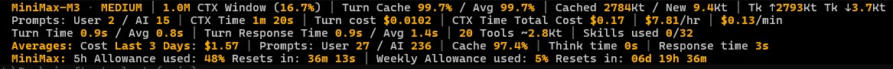
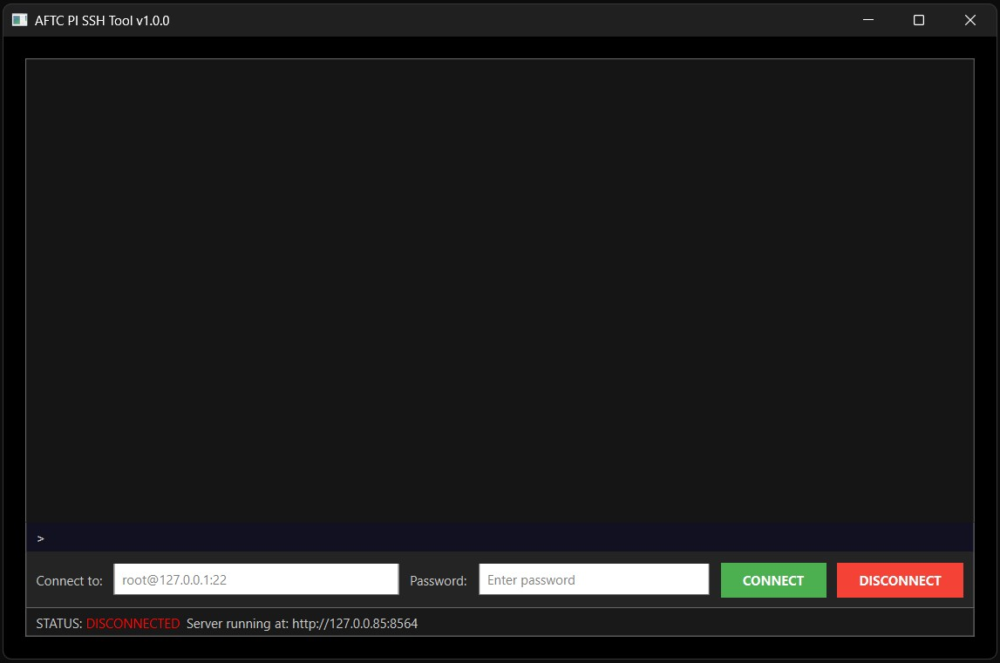

# pi-aftc-toolset

[](https://github.com/DarceyLloyd/pi-aftc-toolset/releases/latest)
[](./LICENSE)

A productivity toolset for the [pi](https://pi.dev) CLI coding agent.

`pi-aftc-toolset` is a collection of tools for pi - from my point of view, essentials to assist with what I do on a daily basis and to get the most out of AI models.

## Footer Widget Preview


---

## Updates v1.7.x

Quick list — full details in their respective sections below.

- **`/keep-it-short`** — new command, tells the model to keep responses short (alias /kis).
- **`/save-replay-prompt` + `/replay (alias /r)`** — save a prompt, re-send it later.
- **`/aftc-set-costs-timeframe`** — new name for the footer timeframe command (old name kept as alias).
- **Footer Widget Subsription Usage Limits and Metrics** — subscription allowance metrics for MiniMax / Z.ai / openai-codex / Anthropic OAuth.
- **Footer Widget Styling Refresh** — Re-arrangements of a lot, color theme compatibility adjutments, sections moved etc.
- **`<think>` tag parsing** — opt-in, see `/aftc-enable-think-processing` and `/aftc-disable-think-processing`, it's designed to process minimax-m3 <think> tags in responses (needs work).
- **Footer Widget fixes and changes** — Units of measurement updaes and fixes, bug fixes and mroe.

---

## Install

### Option 1 - npm (recommended)

```bash
pi install npm:pi-aftc-toolset
```

Then in pi:

```text
/reload
```

> **Runtime dependencies:** `pi install` does not always install native runtime deps. If SQLite or SSH features are unavailable, run `/aftc-install` (see [Dependency installer](#dependency-installer)).

### Option 2 - GitHub

```bash
pi install git:github.com/DarceyLloyd/pi-aftc-toolset
```

Then in pi:

```text
/aftc-install     # installs better-sqlite3 + Python GUI deps
/reload
```

> **GitHub installs require `/aftc-install`.** GitHub installs skip the npm post-install hook, so native dependencies (better-sqlite3, the bundled Python SSH GUI) are not installed automatically. Run `/aftc-install` once after the first install, then `/reload`.

---


## Footer widget


A 4-5 line diagnostic panel (not pi's footer), so it composes alongside other footer/status-bar extensions instead of replacing them. Updates live from pi events and a 1 Hz session sampler. Line 5 (subscription allowance) only appears for providers that expose usage data.

### Line 1 — what's happening right now

Reading left to right:

- **`model` `·` `THINKING`** — which AI model you're using, and the thinking level you set (e.g. `HIGH`).
- **`CTX Window (X%)`** — how big the model's memory is (e.g. `1.0M`), and the `(X%)` is how full that memory is right now. Same number pi shows at the bottom of the screen.
- **`Turn Cache X% / Avg Y%`** — how much of your prompt the model got to reuse from its cache this turn, and your session average. Higher = cheaper.
- **`Cached A / New B`** — of all the stuff you sent this session, how much was cached (`A`) vs sent fresh (`B`).
- **`Tk ↑P Tk ↓Q`** — total tokens sent up to the AI (`P`) and received back (`Q`) this session.

Units: `t` = tokens, `Kt` = thousand tokens, `M` = million tokens (only used for the context window size).

### Line 2 — your money and prompts

- **`Prompts: User N / AI N`** — how many prompts you sent vs how many the AI kicked off on its own (e.g. tool-call follow-ups).
- **`CTX Time`** — how long this session has been alive (e.g. `2h 14m`).
- **`Turn cost`** — what the last prompt cost in dollars.
- **`CTX Time Total Cost`** — what the whole session has cost so far.
- **`$/hr`** and **`$/min`** — how fast you're spending (based on the session clock).

### Line 3 — speed and tools

- **`Turn Time L / Avg A`** — how long the last prompt took (`L`) vs your session average (`A`).
- **`Turn Response Time L / Avg A`** — total round-trip time, last vs average.
- **`N Tools ~X.XKt`** — how many tools the AI can call, and roughly how many tokens they take up in the prompt.
- **`Skills used/avail`** — how many skill files you've loaded this session, out of how many exist (only shown if at least one is loaded).

### Line 4 — long-term averages

Shows your averages over a time window you pick with `/aftc-set-costs-timeframe` (default: last 3 days). Updates from a SQLite log on your disk.

- **`Cost <window>: $X.XX`** — total spend in that window.
- **`Prompts: User X / AI Y`** — prompt counts in that window.
- **`Cache X%`** — average cache hit rate in that window.
- **`Think time X`** and **`Response time X`** — average speeds in that window.

### Line 5 — subscription quota (some providers only)

Only shows up for providers that publish a usage endpoint (openai-codex, MiniMax, Z.ai, Anthropic OAuth).

- **`5h Allowance used: X% Resets in: ...`** — your 5-hour rolling quota.
- **`Weekly Allowance used: Y% Resets in: ...`** — your weekly quota.

**Example (rendered live below the editor):**


Line 4's time window is configurable - see `/aftc-set-costs-timeframe` (alias: `/aftc-footer-report-timeframe`). Defaults to **Last 3 Days**; persisted across `/reload`, `/new`, and fresh pi startup (stored in `.pi-aftc-toolset/data/state.json`). Refreshed at most every 10 s from SQLite.

**Cache hit rate:** `cacheRead / (cacheRead + input)`.

- `Cache Turn` - latest assistant turn only.
- `AVG` - whole-session average.

**Prefix churn** is tracked in `core.ts` and surfaced by `/cache-profile` and `/cache-stats`. When the system prompt or tool schema changes between turns, `/cache-stats` shows the churn reason in the *Cache prefix shape* section.

**Session clock:** wall-clock elapsed since the first user prompt of the current session. In-memory only; cleared on every `session_start`, `/cache-reset`, `/reload`. Cost rate displayed as `$X.XX/hr · $X.XXX/min`.

---


## SSH remote terminal



Persistent remote terminal through a **visible local GUI**. The model asks the SSH tools to run commands; the tools talk to a local Python GUI that holds the real SSH connection.

```text
pi extension (Node.js)
  └─ launches internal-python-gui via uv
      └─ PyQt6 terminal GUI
          ├─ Paramiko SSH client
          ├─ Flask API on http://127.0.0.85:8564
          └─ std/out.txt session log
```

**Credential isolation** - the key safety design:

- Username, server address, and password are entered in the local Python GUI only - never in the pi editor, never in a prompt, never sent to the model.
- The model only calls `ssh_run` with a **command to execute**. It never sees the connection details.
- The Flask API binds to loopback only (`127.0.0.85:8564`).
- The model receives command output, not credentials.

**AI-callable tools:**

| Tool | Description |
| --- | --- |
| `ssh_status` | Check whether the GUI is reachable and connected |
| `ssh_connect` | Launch GUI, connect to `user@host[:port]`, optionally run an initial command |
| `ssh_run` | Execute a non-interactive shell command on the connected server |
| `ssh_peek` | Read recent output from the API buffer or full `std/out.txt` log |
| `ssh_interrupt` | Send repeated Ctrl+C / Ctrl+D to break hung commands |

**Safety notes:**

- Avoid interactive commands (`vim`, `nano`, `top`) in `ssh_run` - they will hang.
- Use `ssh_peek` with `mode: "file"` to inspect the full session history.
- SSH logs under `internal-python-gui/std/` are gitignored.

---

## /cd directory navigation

`/cd` switches the current Pi session to a different directory, always starting a fresh session in the target directory.

With no arguments, `/cd` opens a tree-style directory picker overlay rooted at the current working directory. On confirm, a new session is created in the picked directory and `switchSession` loads it. Cancelling with Esc leaves the current session untouched.

**Listing rules:**

- A synthetic `./` entry is always at index 0 - press Enter on it to switch to a fresh session right here, without navigating up.
- `↑ / ↓` move selection.
- `←` navigate up one level (or to drive listing at the root).
- `→` drill into the highlighted folder. No-op on empty folders and on `./`.
- `Enter` confirm the highlighted entry.
- `PgUp / PgDn` jump by the visible viewport size.
- `Ctrl+PgUp / Ctrl+PgDn` jump to the first / last entry.
- `Tab` autocomplete the highlighted entry into the path input.
- `Esc` cancel without switching.
- Selection always resets to the top after any refresh.
- Listing is unbounded; the viewport scrolls so the selected row is always visible.
- Typing filters the listing by fuzzy match; if no children match, Enter falls through to `/cd <typed>` resolution.

**One-shot path argument** skips the picker:

- `/cd ~/projects` - home-relative.
- `/cd /d/dev/myproject` - absolute (Windows or POSIX).
- `/cd ../sibling-project` - relative to current cwd.
- `/cd brand-new-project` - creates the directory after a confirm dialog if missing.

**Cross-platform:** Windows drive listing probes A-Z via `fs.readdirSync`; POSIX drive listing returns `["/"]`. Path joining / dirname / basename go through Node's `path` so separators are OS-correct. Header line is shortened with `~` on POSIX.

---

## Think-tag processing

Some reasoning models emit their chain-of-thought as text wrapped in `<think>…</think>` tags (the DeepSeek / Qwen convention). pi's provider integrations for those models strip the tags into proper `ThinkingContent` blocks automatically; providers that don't (including some local servers and certain custom wrappers) leave the tags as literal text.

`/aftc-enable-think-processing` turns on a client-side hook that does the conversion at the extension layer. With it on:

- `<think>reasoning here</think>answer` renders as a proper pi thinking block (collapsible, theme-aware, `Ctrl+T` toggle, `hideThinkingBlock` setting).
- Models that already produce native thinking are left alone (no conflict).
- Errors and aborted turns are skipped (no mangle of partial output).

Off by default. Toggle with `/aftc-enable-think-processing` or `/aftc-disable-think-processing`, then `/reload`.

---


## Cache diagnostics

A live hit-rate readout, prefix-shape hashing that detects cache invalidations mid-session, a cache-write ROI calculation, a per-tool token-cost breakdown that surfaces prefix bloat, and a `cache-audit` skill that walks the model through diagnosis. The `cache-viz` theme reinforces the cache metrics visually. None of this exists in stock pi.

The bundled `cache-audit` skill guides the model through a cache diagnostics workflow:

```text
/skill:cache-audit
```

It runs `/cache-stats` and `/cache-profile`, diagnoses low hit rates, explains prefix churn, and suggests cache-stability improvements.

---

## Usage report

**ALPHA** - in development. Output, schema, and defaults may change before the first stable release.

Every completed assistant response with usage data is recorded to a local SQLite database at `.pi-aftc-toolset/data/turns.db`. Generate a report with `/usage-report` - a single self-contained HTML file at `.pi-aftc-toolset/data/report.html`, opened in your browser. No server, no external assets, no build step.

**Report sections:**

| Section | Content |
| --- | --- |
| 1 | Daily totals (last 24 h): most used / most inefficient / highest avg cost / lowest avg cost |
| 2 | Weekly totals (last 7 days), with weekend toggle |
| 3 | Monthly totals (last 28 days), with weekend toggle |
| 4 | Per-model cost report - sortable, period selector (Daily / Weekly / Monthly / All) |
| 5 | Per-model x thinking level - one row per thinking level per model |
| 6 | Cost projections per model x thinking level: $/hr, $/day, $/week, $/month, $/year |

Projections with fewer than ~14 calendar days of data are flagged as estimates. Single-turn handling: denominator is `max(0.5h, active hours)`.

**What gets recorded per turn:** per-turn metrics + prompt-type classification flags. The actual text of prompts and responses is **never** recorded - only flags. This keeps the DB small (~100 bytes / row) and avoids storing sensitive content.

**Prompt classification flags** (`0`/`1`):

| Column | Meaning |
| --- | --- |
| `user_prompt` | Direct response to a user message (`0` for automated continuations) |
| `base_prompt` | First user prompt of a task (drives projections) |
| `sub_prompt` | Follow-up / refinement under the current task |
| `steering_prompt` | Sub-prompt sent while the agent was still processing the previous one |
| `followup_prompt` | Sub-prompt queued in the editor and delivered after the agent finished |
| `continuation_prompt` | Idle follow-up / refinement in the same task thread |
| `prompt_kind` | Human-readable label: `base` / `continuation` / `steer` / `followup` / `auto` |

---

## Bundled skills

Load with `/skill:<name>`. The toolset ships with 32 live skills:

| Skill | Use for |
| --- | --- |
| `git` | Git + GitHub CLI workflow, Conventional Commits, safety rails |
| `bash` / `ps1` / `bat` / `tmux` | Shell scripting and terminal control |
| `html` / `css` / `scss` / `web-frontend` / `react` / `vue` / `angular` | Web frontend |
| `nodejs` / `javascript-mjs` / `javascript-transpiled` / `typescript` / `bun` / `deno` | JS / TS runtimes |
| `python` / `go` / `csharp` / `php` | Backend languages |
| `docker` / `devops` / `nginx` / `linux` | Infra and ops |
| `ffmpeg` | Video / audio / image CLI |
| `markdown-guide` | AI-friendly markdown for READMEs, SKILL.md, rules.md |
| `pinescript` | Pine Script v6 for TradingView |
| `godot` | Godot 4.x engine with GDScript 2.0, MVC architecture, headless compile checks |
| `cache-audit` | Prompt-cache diagnostics workflow |
| `bulk-read` | Concatenate many files into one markdown document |

---


## Slash Commands

Run `/aftc-help` inside pi for the same list grouped by category.

### General

| Command | What it does |
| --- | --- |
| `/aftc-help` | Grouped command/shortcut reference |
| `/aftc-install` | Install runtime deps (SQLite + Python SSH GUI) |
| `/aftc-response-divider` | Toggle the themed divider above each assistant reply |
| `/cls` | Clear the terminal |
| `/theme` | Open a theme picker (arrow keys, page jumps, pre-selects active theme) |

### Interrupt

| Command | What it does |
| --- | --- |
| `/aftc-stop` | Abort the current agent operation |
| `/stfu` | Short alias for `/aftc-stop` |

### Navigation

| Command | What it does |
| --- | --- |
| `/cd [path]` | Switch directory (interactive picker or one-shot path). Always starts a fresh session. |
| `/cd-set-max-depth [2-10]` | Set the `/cd` picker listing depth (default 3) |
| `/dir` (alias `/ls`) | Show the current directory name + platform-native listing |
| `/cwd` | Show the current working directory as an inline card |

### Footer, cache, timing

| Command | What it does |
| --- | --- |
| `/aftc-footer` | Toggle the footer dashboard widget on/off |
| `/aftc-set-costs-timeframe` | Set the footer AVG-window (default: Last 3 Days; options: Today, Last 3 Hours, Last 6 Hours, Last 24 Hours, Last 2 Days, Last 3 Days, Last 7 Days, Last 28 Days). Alias: `/aftc-footer-report-timeframe` |
| `/cache-profile` | Per-tool token costs, prefix shape, churn analysis |
| `/cache-stats` | Current-context cache diagnostics + cost rate |
| `/cache-reset` | Zero accumulators and timer (debugging) |

### SSH

| Command | What it does |
| --- | --- |
| `/ssh-gui` | Launch the local PyQt6 SSH GUI |
| `/ssh-connect` | Connect to `user@host[:port]` (use the GUI for credentials) |
| `/ssh-run` | Run a one-shot command on the connected server |
| `/ssh-status` | Show GUI running state + connection status |
| `/ssh-disconnect` | Disconnect the active SSH session (use the GUI) |

### Usage

| Command | What it does |
| --- | --- |
| `/usage-report` | Write + open `report.html` (ALPHA) |
| `/usage-clear` | Delete all SQLite rows (with confirmation) |

### Replay

| Command | What it does |
| --- | --- |
| `/save-replay-prompt <text>` | Save `<text>` as a replay prompt (persists across reload/sessions) |
| `/replay` | Re-execute the saved prompt as a fresh user message (queued as follow-up when busy) |
| `/r` | Short alias for `/replay` — same action, fewer keystrokes |

### Model behaviour

| Command | What it does |
| --- | --- |
| `/keep-it-short` | Send a fixed "be concise" instruction prompt to the active model (queued as follow-up when busy) |
| `/kis` | Short alias for `/keep-it-short` — same action, fewer keystrokes |

### Thinking

| Command | What it does |
| --- | --- |
| `/aftc-enable-think-processing` | Turn on inline `<think>…</think>` tag parsing (off by default; `/reload` to apply) |
| `/aftc-disable-think-processing` | Turn off inline `<think>…</think>` tag parsing (`/reload` to apply) |

### Keyboard shortcuts

| Shortcut | Action |
| --- | --- |
| `Alt+C` | Clear the input editor |
| `Ctrl+T` | Toggle thinking blocks |

### Bundled themes

- **aftc-orange-viz** - orange-accented variant of the sea-shells palette (the AFTC default, recommended).
- **cache-viz** - cache-focused green/cyan colour scheme.
- **aftc-black-n-blue** - dark blue accents on black.

Switch themes with `/theme`.

---


## Updating

```bash
pi update npm:pi-aftc-toolset
```

or install a pinned GitHub release:

```bash
pi install git:github.com/DarceyLloyd/pi-aftc-toolset@v<version>
```

Then `/reload` in pi.

---

## Uninstall

```bash
pi remove npm:pi-aftc-toolset          # global
pi remove npm:pi-aftc-toolset -l       # project-local
```

or if you installed via GitHub:

```bash
pi remove git:github.com/DarceyLloyd/pi-aftc-toolset
```

Then `/reload` or restart pi.

---

## Advanced installation

### npm variants

```bash
pi install npm:pi-aftc-toolset          # global
pi install npm:pi-aftc-toolset -l       # project-local
pi -e npm:pi-aftc-toolset               # ephemeral (current session only)
```

### GitHub variants

```bash
pi install git:github.com/DarceyLloyd/pi-aftc-toolset         # latest main
pi install git:github.com/DarceyLloyd/pi-aftc-toolset@v1.6.0  # pinned release
pi install git:github.com/DarceyLloyd/pi-aftc-toolset -l      # project-local
```

> GitHub installs skip npm post-install hooks - run `/aftc-install` once after the first install.

### Local clone

```bash
git clone https://github.com/DarceyLloyd/pi-aftc-toolset.git
pi install /path/to/pi-aftc-toolset -l
```

---

## Dependency installer

`/aftc-install` (see [Slash Commands](#slash-commands)) installs:

- `better-sqlite3` via `npm install`
- Python GUI dependencies via `uv sync` inside `internal-python-gui/`
- A bundled `uv.exe` automatically if required

Reload pi afterwards. The footer works without SQLite, but usage recording / reporting and SSH require `/aftc-install`.

---

## Requirements

- pi CLI
- Node.js / npm
- Providers that expose `usage.cacheRead` and `usage.cacheWrite` for full cache metrics (other providers may show zero / incomplete cache values)
- Python (installed automatically by `/aftc-install` via bundled `uv.exe`) for the SSH GUI

---

## Development

Install from a clone:

```bash
pi install /path/to/pi-aftc-toolset -l
```

After edits, reload pi with `/reload`.

### Key files

```text
extensions/toolset/index.ts             extension entry point + orchestrator
extensions/toolset/core.ts              cache/timing data + commands
extensions/toolset/footer-widget.ts     cache dashboard widget + /aftc-footer
extensions/toolset/think-parser.ts      inline <think>…</think> tag → ThinkingContent block conversion
extensions/toolset/usage-report.ts      usage report generator
extensions/toolset/usage-recording.ts   per-turn SQLite recording
extensions/toolset/ssh.ts               SSH tools and commands
extensions/toolset/response.ts          response divider + /aftc-response-divider
extensions/toolset/theme.ts              /theme shortcut to pi's theme picker
extensions/toolset/cd.ts                /cd directory picker
extensions/toolset/cwd.ts               /cwd current-directory display
extensions/toolset/dir.ts               /dir + /ls listing
extensions/toolset/help.ts              /aftc-help command reference
internal-python-gui/main.py             local SSH GUI/API
skills/                                 32 live skills (see Bundled skills above)
themes/cache-viz.json                   cache-oriented pi theme (green/cyan)
themes/aftc-orange-viz.json             orange-accented pi theme
themes/aftc-black-n-blue.json           dark blue accents on black theme
```

Each TS file has a sibling `<name>.readme.md` documenting its contract (events, commands, factory signature, failure modes). See `extensions/toolset/readme.md` for the folder-level overview, and `rules.md` for source-of-truth development conventions.

### Tests

Each test has its own subfolder under `tests/` (dependency-free - `node` + pi's bundled jiti + `better-sqlite3` only):

```bash
node tests/parse-check/parse-check.mjs
node tests/full-check/full-check.mjs
node tests/widget-render-check/widget-render-check.mjs
node tests/stfu-check/stfu-check.cjs
node tests/bulk-read-check/bulk-read-check.mjs
node tests/theme-check/theme-check.cjs
node tests/state-check/state-check.cjs
node tests/cd-no-preserve/cd-no-preserve.cjs
node tests/cd-picker-top/cd-picker-top.cjs
node tests/load-test/load-test.cjs
node tests/replay-check/replay-check.cjs
node tests/prompt-tracking-check/prompt-tracking-check.mjs
node tests/allowance-check/allowance-check.mjs
node tests/think-parser-check/think-parser-check.cjs
node tests/footer-line1-check/footer-line1-check.cjs
```

See `tests/README.md` for the full layout and conventions.

---

## Persistent files

Project-local runtime data lives under `.pi-aftc-toolset/data/`:

| File | Purpose |
| --- | --- |
| `state.json` | Cross-session user preferences (footer AVG timeframe, footer on/off, response divider on/off). Created with defaults on first access; only re-written when a preference actually changes. |
| `turns.db` | SQLite usage database |
| `report.html` | Latest generated usage report |

In-memory only (per-session, not persisted): cache accumulators, model info, per-turn timings, context-window clock start time.

SSH GUI runtime files live under `internal-python-gui/std/` and are gitignored.

---

## License

[MIT](./LICENSE) - Author <Darcey.Lloyd@gmail.com>