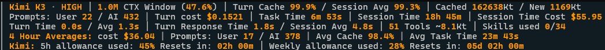
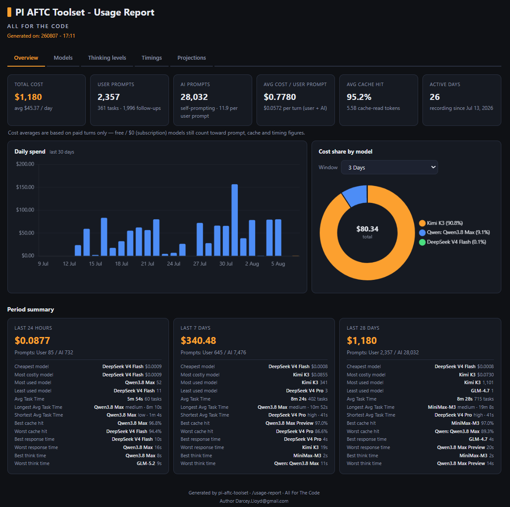
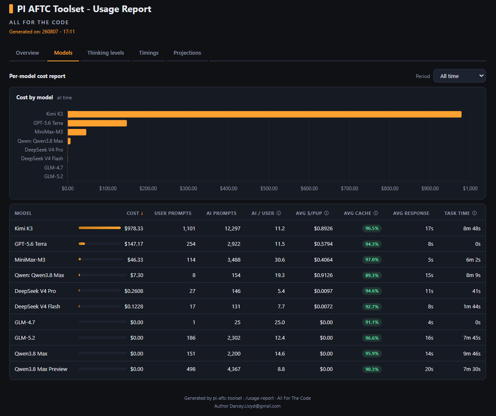
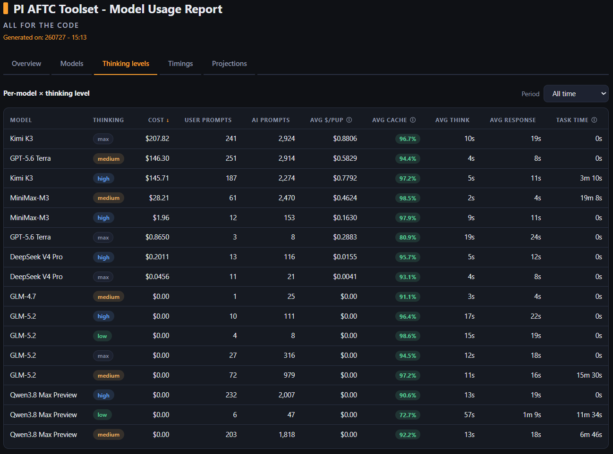
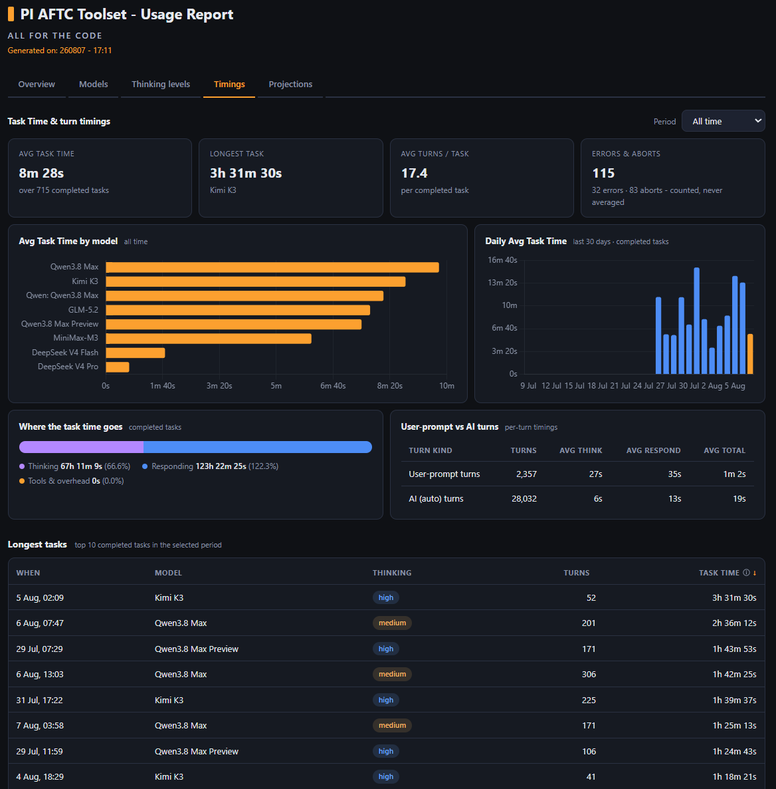
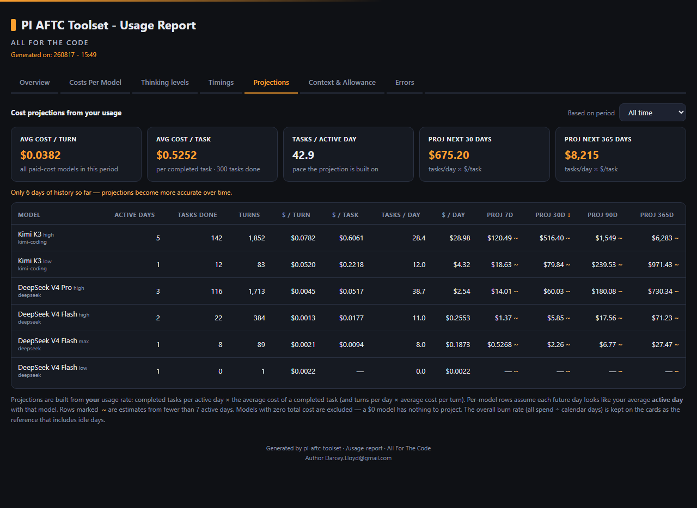

# **pi-aftc-toolset**


[](./LICENSE)

The `pi-aftc-toolset` is a productivity toolset for the [pi](https://pi.dev) CLI coding agent.

This is a collection of tools for which assist with what I do on a daily basis to help get the most out of AI models. 

Click [here](./change-log.txt) to read the change logs.

---

<br><br>


## **WHATS NEW**

### **/docx project documentation generator**
One command — `/docx` — generates a complete, cross-referenced documentation set for any project: a fresh GitHub README.md, a master document, a full ID'd structure map, and per-module deep docs under `./docx/`. Your old docs are never lost: they're moved aside with their folder structure intact and zipped to `docx/old_docs.zip`. See [/docx project documentation generator](#docx-project-documentation-generator).

### **AFTC CODEX PATCHES & UPDATED CODEX RESOURCES**
Fixed some bugs, adjusted learning process and model guidance. And brought synced my latest codex resources for you all to use..


---

<br><br>


## **Install**

### **Option 1 - npm (recommended)**

```bash
pi install npm:pi-aftc-toolset
```

Then in pi:

```text
/aftc-install     # installs better-sqlite3 + packaged SSH carrier deps (python)
/reload
```

> **Runtime dependencies:** `pi install` does not install all the required runtime deps. Run `/aftc-install` after extension installation.

---

<br><br>

# **Quick Documentation & Links**
- [**Footer Widget**](#footer-widget)
- [**SSH**](#ssh)

- [**DOCX Documentation Generator (BETA)**](#docx-project-documentation-generator)
    > **WARNING: This will re-write readme.md and move all existing documentation.**
    If you have a docs folder it will move all documentation to `./docx/old_docs.zip` before generating indepth modular documenation designed for AI use while being human friendlyalso. This can take a long time the larger the project is. 
    
    > **WARNING: Context compaction danger**. If you run this when your context use is high or nearing compaction this could corrupt the documentation process. It's best to start a fresh context window and run /docx to guarantee the best chance of success.

- [**Usage Report**](#usage-report) (BETA 3)
- [**AFTC Codex**](#aftc-codex-knowledge-base) (BETA)

    > **WARNING**: AFTC Codex injects rules + guidance into your system prompt and tells the model to load additional topic docs on demand. This results in the model having access to potentially a lot of rules, issues & solutions and gotchyas. Loading 1 to 5 is light enough, loading 20 can be costly but necessary when you have something complex that you want the AI to have its best shot at working out and one shotting it.
    
    > I recommend you create a plan.md and a tasks.md first so that you can maximise your use of the codex skills.

    > Codex results: I've found it to be very beneficial when asking models to perform tasks on projects containing multiple projects eg docker, apache php, mysql containers with complex setups and containing inner php framework backend api and public and private websites. GLM 5.2, Kimi K3 and Qwen 3.8 Max (3.7 Max is good too) I find perform the best in these situations.
    
    > **WARNING**: If you are counting the cost of every token or have low tier 

- [**Audio notifications**](#slash-commands) /aftc-notifications
- [**Slash commands**](#slash-commands) /aftc-* /codex-*
- [**Keyboard shortcuts**](#keyboard-shortcuts) Alt+C / Alt+N / Alt+X
- [**run_script**](#run_script-reliable-large-scripts)

    > Reliable large/multi-line script execution. Works around a pi bash-tool truncation bug that silently drops inline commands past a few KB.
- [**Cache diagnostics**](#cache-diagnostics)
- [**/cd directory navigation**](#cd-directory-navigation)
- [**Bundled skills**](#bundled-skills)
- [**Feature defaults**](#pi-aftc-toolset-defaults)
- [**Data location**](#data-location)
- [**Advanced installation and uninstall guide**](#advanced-installation)
- [**Project documentation**](#project-documentation)

---

<br><br>


## **Footer widget**



A 4-5 line diagnostic panel (not pi's footer), so it composes alongside other footer/status-bar extensions instead of replacing them. Updates live from pi events and a 1 Hz session sampler. Line 5 (subscription allowance) only appears for providers that expose usage data.

### Line 1 — what's happening right now

Reading left to right:

- **`model` & `THINKING LEVEL`** — which AI model you're using, and the thinking level you set (e.g. `HIGH`).
- **`CTX Window (%)`** — how big the model's memory is (e.g. `1.0M`), and the `(X%)` is how full that memory is right now. Same number pi shows at the bottom of the screen.
- **`Turn Cache % / Avg %`** — how much of your prompt the model got to reuse from its cache this turn, and your session average. Higher = cheaper.
- **`Cached A / New B`** — of all the stuff you sent this session, how much was cached (`A`) vs sent fresh (`B`).
- **`Tk ↑P Tk ↓Q`** — total tokens sent up to the AI (`P`) and received back (`Q`) this session.

Units: `t` = tokens, `Kt` = thousand tokens, `M` = million tokens (only used for the context window size).

### Line 2 — your money and prompts

- **`Prompts: User N / AI N`** — how many prompts you sent vs how many the AI kicked off on its own (e.g. tool-call follow-ups).
- **`Turn cost`** — what the last prompt cost in dollars.
- **`Task Time`** — how long the AI took to fully handle your last prompt and return control (one prompt's complete run, across all its tool-call turns), formatted like Session Time. Ticks live while the AI works, then holds the last task's duration; an error/abort shows the time to that point but isn't recorded. Runs through questions, steering, retries and compaction.
- **`Session Time`** — how long this session has been alive (e.g. `2h 14m`).
- **`Session Time Cost`** — what the whole session has cost so far.
- **`$/hr`** and **`$/min`** — how fast you're spending (based on the session clock).

### Line 3 — speed and tools

- **`Turn Time L / Avg A`** — how long the last prompt took (`L`) vs your session average (`A`).
- **`Turn Response Time L / Avg A`** — total round-trip time, last vs average.
- **`N Tools ~X.XKt`** — how many tools the AI can call, and roughly how many tokens they take up in the prompt.
- **`Skills used/avail`** — how many skill files you've loaded this session, out of how many exist (only shown if at least one is loaded).

### Line 4 — long-term averages

Shows totals and averages over a time window you pick in the `/aftc-footer` menu -> **Set averages timeframe** (default: 3 Days); hide the whole line with **Show recorded averages** in the same menu. Updates from a SQLite log on your disk.

Format: `<Window> Averages: cost $X.XX | Prompts: User X / AI Y | Avg Cache X% | Avg Task Time X` — the prefix names the window (eg `3 Hour Averages:`, `Today Averages:`, `This Month Averages:`).

- **`cost`** — total spend in that window (money-formatted: `$0.00` / 4 decimals under $1 / 2 decimals / thousands separators at $1,000+).
- **`Prompts: User / AI`** — prompt SUMS in that window (AI = tool-call continuation turns).
- **`Avg Cache`** — average cache hit rate in that window.
- **`Avg Task Time`** — average wall-clock of COMPLETED tasks in that window (failed/aborted tasks excluded).

Two window families: rolling "Last ..." windows (1, 2, 3, 4, 5, 6, 12, 24, 48 and 72 hours — measured back from your current time) and calendar windows (1 Day = since midnight, 2/3/5/7 Days = calendar days including today, Month / 3 Months / 6 Months = since the 1st of the month, 1 Year = since January 1st).

### Line 5 — subscription quota (some providers only)

Only shows up for providers that publish a usage endpoint (openai-codex, MiniMax, Z.ai, Kimi for Coding, Anthropic OAuth).

- **`5h Allowance used: X% Resets in: ...`** — your 5-hour rolling quota.
- **`Weekly Allowance used: Y% Resets in: ...`** — your weekly quota.

--- 

<br><br>

## **SSH**

The old SSH GUI and features are gone, a new more fully featured SSH feature has been built and tested from the ground up windows first and then for linux (I don't have a mac, so lets hope the linux testing gets it working for the OSX peeps). 

**Remember this is for AI models to use so if you manually want to use ssh then use your local ssh command in terminal or any of various free software out there, but still I built you `/ssh-shell` so you can mostly use SSH in pi.**

Connect to remote machines over SSH from inside pi - run commands, open interactive shells (Nano, Vi, htop, tmux), transfer files, manage remote files, and open port forwards. The feature runs a packaged Paramiko carrier as a local process that talks JSON-RPC over its own standard input and output; it never opens a listening socket, an HTTP service, or a local GUI bridge. It supports multiple simultaneous in-memory connections, password and private-key (including encrypted-key) authentication, host-key approval, non-interactive commands with bounded standard input, recursive SFTP transfers, remote file operations, interactive PTY shells, and local (-L), remote (-R), and dynamic SOCKS5 (-D) port forwarding.

> **The AI model is never given any SSH connection details.** Every connection is authorised and opened locally. The model can connect to server by connection name - connection details are stored in a json file and only read by typescript functions and the python sidecar, it is never given to the AI model. The AI model never sees usernames, hosts, ports, passwords, private-key paths, passphrases, fingerprints, or forwarding endpoints. All command output, file content, carrier errors, and stderr are bounded and redacted before they reach the model. Passwords and key passphrases live in memory for a single connection attempt and are cleared immediately afterwards.

### Ensure dependencies are installed

SSH needs native runtime dependencies that `pi install` does not always set up:

- **Python 3** (`py`/`python` on Windows, `python3`/`python` elsewhere) - runs the packaged carrier.
- **uv** - the carrier's package manager. `/aftc-install` uses the platform-native `uv.exe` on Windows and `uv` elsewhere.
- **The packaged carrier environment** - installed via `uv sync --locked` against the carrier shipped inside the package.
- **better-sqlite3** - installed via `npm install` (shared with the usage feature).

Run it once after install:

```text
/aftc-install
/reload
```

`/aftc-install` checks for Node, Python, and uv, reports platform-specific recovery guidance if any are missing, and verifies the carrier with the same ready handshake the runtime uses. npm installs run the post-install hook automatically; **GitHub and local-clone installs skip it, so `/aftc-install` is required for SSH**. See [Dependency installer](#dependency-installer) for the full list. The footer works without these dependencies, but SSH (and usage recording/reporting) do not.

### **SSH commands**

Every SSH command is local - it runs against a session you authorised yourself. `/ssh-help` shows the same reference inside pi.

| Command | What it does |
| --- | --- |
| `/ssh-cm` | Full-screen connection manager: add / edit / delete saved connections |
| `/ssh-connections` | List your locally saved connection names |
| `/ssh-connect [name]` | Connect to a saved connection (by name or picker) |
| `/ssh-auto-accept-session-on` | Auto-approve new SSH host keys (saved in ssh.json) |
| `/ssh-auto-accept-session-off` | Ask before trusting new SSH host keys (default) |
| `/ssh-status` | Show `SSH Status: Connected to <name>` or `SSH Status: Not connected` |
| `/ssh-select [id]` | Choose the active session used by local SSH commands |
| `/ssh-shell` | Open a full-screen interactive terminal on the selected session |
| `/ssh-close-shell <id>` | Close an interactive shell |
| `/ssh-interrupt <id>` | Send recovery keys (Ctrl+C / Ctrl+D) to a shell |
| `/ssh-upload <local> <remote>` | Upload a file (`--preserve` keeps remote attrs) |
| `/ssh-download <remote> <local>` | Download a file (`--preserve` keeps local attrs) |
| `/ssh-rename <from> <to>` | Rename a remote path (asks for confirmation) |
| `/ssh-disconnect [id]` | Disconnect an SSH session |
| `/ssh-help` | Show the SSH workflow reference |

Running commands, inspecting and changing remote files, and driving
interactive programs are the model tools' jobs — ask the model and it uses
`ssh_run`, `ssh_read_file`, `ssh_write_file`, and friends. Port forwarding
has no user or model surface; use `ssh -L` / `-R` / `-D` from your own
terminal when you need a tunnel.

### How to manage connections

Saved connections are local metadata only - a name you choose, plus the non-secret connection details (username, host, port, timeout, an optional private-key path, and an optional saved password). They live in `ssh.json` in your OS data dir (see [Data location](#data-location)), which is outside the package and never shipped.

Run `/ssh-cm` (or `/ssh-connection-manager`) to open the full-screen connection manager. The bottom options row offers **Add new connection**, **Edit**, and **Delete** for the highlighted entry (Tab moves between the list and the options, Left/Right moves between options, Enter activates):

- **Add** opens the new-connection dialog (validation, empty-password and name-collision confirms).
- **Edit** opens the same form pre-filled; a saved password is kept, and renaming through the name field removes the old record.
- **Delete** asks "Are you sure?" before removing the record (a live session started from it keeps running).

Saved connections are created in the connection manager (`/ssh-cm`).

### How to connect

Run `/ssh-connect` (or `/ssh-connect <name>` to jump straight to one). With no name it lists your saved connections — connect-only; new connections are made in `/ssh-cm`. With none saved it points you there. A connection with a saved password connects immediately; otherwise you enter the password or key passphrase for that attempt (never stored, never shown to the model). On the first connection to a host you approve its key locally (or skip the prompt with `/ssh-auto-accept-session-on`) without the fingerprint ever reaching the model; a changed key is rejected by default. Credentials are held in memory for that one attempt and cleared immediately afterwards - including through the new-host approval retry. Several connections and shells can be open at once; their names and opaque ids are tracked only in memory and clear on reload, new session, resume, or exit.

### How to disconnect

`/ssh-disconnect` closes the active session (or `/ssh-disconnect <id>` a specific one); the model can call `ssh_disconnect` with an opaque id. Disconnecting clears the session's redaction boundary, closes its shells and forwards, and stops anything it owned.

The carrier is lazy and self-cleaning. It starts on first SSH use and, once the last session disconnects (or is lost), a short TS-side grace window stops it; if pi is killed or wedged, the sidecar self-exits on a closed stdin pipe and, as a last resort, an idle watchdog (10-minute default, overridable with `AFTC_SSH_IDLE_TIMEOUT_SEC`) closes it. The next connect relaunches a fresh sidecar through the same path.

### Run commands and pick a session

`/ssh-status` shows whether you are connected, and to which server. `/ssh-select [id]` sets which session local commands (`/ssh-shell`, transfers) act on. Running remote commands is a model tool job: ask the model and it uses `ssh_run`, which reports exit code, stdout/stderr presence, and truncation; large output is also written to a local redacted file you can inspect.

### Interactive shells

`/ssh-shell` opens a full-screen interactive terminal (TUI only) attached to the selected session: the remote terminal renders inside the AFTC takeover frame through a built-in virtual screen, so cursor-addressed programs (Nano, Vi, htop, top, less) display properly. It forwards normal text, Enter, Tab, arrows, function keys, Ctrl combinations, bracketed paste, resize, and interrupt. Press **Ctrl+]** to leave the terminal locally without sending that chord to the remote host. `/ssh-close-shell <id>` closes a shell and `/ssh-interrupt <id>` sends it recovery keys (Ctrl+C / Ctrl+D).

### Transfer files

`/ssh-upload <local> <remote>` and `/ssh-download <remote> <local>` move files with local overwrite confirmation. Both support an opt-in `--preserve` flag that restores remote timestamps and permission bits on upload, and local timestamps (plus permissions on POSIX hosts) on download; it is off by default. Transfers run in chunks so a large transfer can be cancelled mid-flight - aborting stops the carrier and removes its temporary file, leaving nothing behind.

### Manage remote files

Remote file work is a model tool job: the model uses `ssh_list_dir`, `ssh_stat`, and `ssh_read_file` to inspect, and `ssh_write_file`, `ssh_mkdir`, `ssh_rename`, and `ssh_remove` to change — every remote-mutating operation requires explicit local-user confirmation. The one remaining user command, `/ssh-rename <from> <to>`, renames a remote path after confirmation. Large reads are also saved to a local redacted file so you can inspect the full content without it entering the model context.

### Model tools

The model can help with SSH work through opaque session and shell ids. It can connect and reconnect a saved server by name and disconnect when done, but it can never create, edit, or delete a connection and never sees host, user, port, key path, password, passphrase, or fingerprint data.

- `ssh_status`, `ssh_connect`, and `ssh_disconnect` manage the connection surface. `ssh_connect(<name>)` connects a saved server (or returns the existing opaque id if already connected); a local prompt collects credentials each time and the model supplies none. It throws for an unknown name and never offers to create one, and fails safely in headless mode.
- `ssh_run` runs non-interactive commands with bounded standard input.
- `ssh_open_shell`, `ssh_send_keys`, `ssh_paste`, `ssh_resize`, `ssh_peek`, `ssh_interrupt`, and `ssh_close` drive interactive programs such as Nano and Vi.
- `ssh_upload`, `ssh_download`, `ssh_list_dir`, `ssh_read_file`, `ssh_stat`, `ssh_write_file`, `ssh_mkdir`, `ssh_rename`, and `ssh_remove` support file administration; the destructive ones require local-user confirmation.

Every tool result is bounded and redacted. The only connection-level model tools are `ssh_status`, `ssh_connect`, and `ssh_disconnect`; no model tool can create, save, edit, rename, or forget a connection.

### Credential isolation

- Saved connection records contain only local connection metadata. Passwords and key passphrases are never persisted.
- `/ssh-connect` collects credentials locally for each connection attempt, including saved connections.
- The model can connect or reconnect a saved server by name (credentials collected locally each time) or use a session you have already opened, but it can never create, edit, or delete a connection.
- Model tools receive opaque session and shell ids, never usernames, hosts, ports, passwords, key paths, or fingerprints.
- Output, file content, and carrier failures are bounded and redacted before they reach the model.
- Redaction values are registered and removed around every active connection, and the boundary survives a connection being renamed or removed.

---

<br><br>

## **/cd directory navigation**

`/cd` switches the current Pi session to a different directory, always starting a fresh session in the target directory.

With no arguments, `/cd` opens a tree-style directory picker overlay rooted at the current working directory. On confirm, a new session is created in the picked directory and `switchSession` loads it. Cancelling with Esc leaves the current session untouched.

**Listing rules:**

- A synthetic `./` entry is always at index 0 - press Enter on it to switch to a fresh session right here, without navigating up.
- `↑ / ↓` move selection.
- `←` navigate up one level (or to drive listing at the root).
- `→` drill into the highlighted folder. No-op on empty folders and on `./`.
- `Enter` confirm the highlighted entry.
- `PgUp / PgDn` jump by the visible viewport size.
- `Ctrl+PgUp / Ctrl+PgDn` jump to the first / last entry.
- `Tab` autocomplete the highlighted entry into the path input.
- `Esc` cancel without switching.
- Selection always resets to the top after any refresh.
- Listing is unbounded; the viewport scrolls so the selected row is always visible.
- Typing filters the listing by fuzzy match; if no children match, Enter falls through to `/cd <typed>` resolution.

**One-shot path argument** skips the picker:

- `/cd ~/projects` - home-relative.
- `/cd /d/dev/myproject` - absolute (Windows or POSIX).
- `/cd ../sibling-project` - relative to current cwd.
- `/cd brand-new-project` - creates the directory after a confirm dialog if missing.

**Cross-platform:** Windows drive listing probes A-Z via `fs.readdirSync`; POSIX drive listing returns `["/"]`. Path joining / dirname / basename go through Node's `path` so separators are OS-correct. Header line is shortened with `~` on POSIX.

---

<br><br>

## **Think-tag processing**

Some reasoning models emit their chain-of-thought as text wrapped in `<think>…</think>` tags (the DeepSeek / Qwen convention). pi's provider integrations for those models strip the tags into proper `ThinkingContent` blocks automatically; providers that don't (including some local servers and certain custom wrappers) leave the tags as literal text.

`/aftc-enable-think-processing` turns on a client-side hook that does the conversion at the extension layer. With it on:

- `<think>reasoning here</think>answer` renders as a proper pi thinking block (collapsible, theme-aware, `Ctrl+T` toggle, `hideThinkingBlock` setting).
- Models that already produce native thinking are left alone (no conflict).
- Errors and aborted turns are skipped (no mangle of partial output).

Off by default. Toggle with `/aftc-enable-think-processing` or `/aftc-disable-think-processing`, then `/reload`.

---

<br><br>

## **QwenCloud / Alibaba providers**

> **Currently disabled** — pi 0.81 added native provider registration, so this module is disconnected (but still shipped). It can be re-enabled if the native support proves weaker. The notes below apply when it is enabled.


Adds Alibaba's Qwen lineup to pi's **native `/login`** and the `Ctrl+L` model picker — no config files to edit, credentials are stored by pi in its own `auth.json` like any built-in provider.

Two providers are registered:

| Provider | For | How to log in |
| --- | --- | --- |
| **Qwen Coding Plan** | Model Studio Coding Plan subscription (Lite / Standard / Pro) | `/login` → Plans → **Qwen Coding Plan** → paste your `sk-sp-…` or `sk-tok-…` token |
| **Qwen Cloud (DashScope)** | Pay-per-token DashScope API | `/login` → Use an API key → **Qwen Cloud (DashScope)** → paste your `sk-…` key — or set `DASHSCOPE_API_KEY` in your environment |

Then open the model picker (`Ctrl+L`) and pick a Qwen model.

- **Self-updating model list**: the extension pulls the live catalog from Alibaba on every pi start (and right after a Plan login), so newly released models appear on their own. Offline? It falls back to the last fetched list, then to a small built-in seed — pi is never blocked.
- **All regions**: Cloud defaults to the International endpoint; switch to China or a custom domain via `/qwencloud`. Plan endpoints default to Singapore with a custom option.
- **OpenAI-compatible by default** (Alibaba's best-supported API shape); each provider can be switched to their Anthropic-compatible shape in the menu.
- Reasoning models get native thinking support; vision models accept images automatically.

Manage everything with **`/qwencloud`**: status (login state, endpoints, model counts), refresh model lists, cloud region, API formats, plan endpoints, and re-login help.

---

<br><br>

## **Cache diagnostics**

A live hit-rate readout, prefix-shape hashing that detects cache invalidations mid-session, a cache-write ROI calculation, a per-tool token-cost breakdown that surfaces prefix bloat, and a `cache-audit` skill that walks the model through diagnosis. The `cache-viz` theme reinforces the cache metrics visually. None of this exists in stock pi.

The bundled `cache-audit` skill guides the model through a cache diagnostics workflow:

```text
/skill:cache-audit
```

It runs `/cache-stats` and `/cache-profile`, diagnoses low hit rates, explains prefix churn, and suggests cache-stability improvements.

---

<br><br>

## **Usage report**

Every completed assistant response with usage data is recorded to a local SQLite database (`turns.db` in your OS data dir - see [Data location](#data-location)), and every settled task (prompt → AI finished) is recorded alongside it with its wall-clock **Task Time** and outcome. Generate a report with `/usage-report` - a single self-contained HTML file (`report.html` in the same data dir), opened in your browser. Dark themed, AFTC-branded, organised into five tabs (Overview, Models, Thinking levels, Timings, Projections). Graphs use Chart.js from a pinned CDN (the only external reference); offline the charts degrade to a note and every table and card still works.

Prompt counts are split the same way as the footer widget: **User prompts** (what you typed) vs **AI prompts** (self-prompted tool-call turns). Cost averages use **paid turns only** - free / $0 (subscription) models are still recorded for prompt, cache and timing stats, but they never drag cost averages down. To skip recording $0 turns entirely, set `RECORD_ZERO_COST_TURNS = false` in `extensions/aftc-toolset/usage-recording.ts`.



**Overview** - the headline numbers at a glance: total cost with avg per day, user prompts (tasks + follow-ups), AI prompts (self-prompting turns and how many run per user prompt), avg cost per user prompt, avg cache hit, and active days. Below the cards: a daily-spend bar chart for the last 30 days (today highlighted), a cost-share doughnut showing which models your money goes to, and period summary cards for the last 24 hours / 7 days / 28 days. Each card carries a per-model scoreboard (cheapest / most costly, most / least used, **avg task time**, best / worst cache hit, response time and think time) that only lists models which cost something in the window - $0 models never appear.



**Models** - the per-model cost report. A period selector (24 hours / 7 days / 28 days / all time) drives both the cost-by-model bar chart and the sortable table: cost (with share bars), user prompts, AI prompts, AI/user ratio, Avg $/Pup (average cost per user prompt), Avg cache, avg response time and **Task time** (how long the AI took to fully handle your prompts and return control, averaged over that model's completed tasks). Every non-obvious column has an info icon with a hover tooltip explaining exactly what the values mean and how they're derived.



**Thinking levels** - the same breakdown per model x thinking level (one row per combination you've actually used), adding avg think time and Task time. Answer questions like "does max thinking actually cost me more than medium?" with real numbers for your own usage.

**Timings** - built around Task Time: the wall-clock time from when you press enter to when the AI fully returns control (one prompt's complete run, across all its tool-call turns). Cards show the avg task time, the longest task (and which model ran it), avg turns per task, and error & abort counts (failed tasks are recorded too - counted, but never averaged into Task Time). Charts break task time down by model and by day; a stacked bar shows where the time goes (thinking / responding / tools & overhead); a mini table compares user-prompt turns against AI (auto) turns; and the top-10 longest tasks are listed with model, thinking level and turn count.





**Projections** - what your current usage pattern costs over time. The cards show the overall burn rate: avg $/day across all calendar days since recording began (idle days included), projected month (x30.4) and year (x365). The table breaks it down per model x thinking level: $/day, $/week, $/month, $/year derived from spend per **active day**. Rows built on fewer than 7 active days are marked `~` as estimates, the overall figures are flagged until you have 14+ days of history, and models with zero total cost are left out entirely.

**What gets recorded per turn:** per-turn metrics + prompt-type classification flags. The actual text of prompts and responses is **never** recorded - only flags. This keeps the DB small (~100 bytes / row) and avoids storing sensitive content.

**Prompt classification flags** (`0`/`1`):

| Column | Meaning |
| --- | --- |
| `user_prompt` | Direct response to a user message (`0` for automated continuations) |
| `base_prompt` | First user prompt of a task (drives projections) |
| `sub_prompt` | Follow-up / refinement under the current task |
| `steering_prompt` | Sub-prompt sent while the agent was still processing the previous one |
| `followup_prompt` | Sub-prompt queued in the editor and delivered after the agent finished |
| `continuation_prompt` | Idle follow-up / refinement in the same task thread |
| `prompt_kind` | Human-readable label: `base` / `continuation` / `steer` / `followup` / `auto` |

---

<br><br>

## **aftc-codex (knowledge base)**

An opt-in knowledge base that makes the model follow your curated coding conventions. When enabled, pi-aftc-toolset injects a unified rules file + thinking-and-action guidance + a generated resource list into the model's system prompt (the cached prefix, so it is cheap), and gives the model a `codex_load` tool to fetch the full topic doc for a technology only when it is relevant.

It ships pre-trained with 60 topic docs (TypeScript, Python, JavaScript, PHP, Pine Script, CSS, SCSS, HTML, C++, Three.js, Chart.js, GSAP, PyTorch, Gradio, Shoelace, Godot, Docker, Vite, Webpack, Bun, Composer, MySQL, FFmpeg, Puppeteer, Apache, nginx, WinRAR, PowerShell, Blazor, .NET MAUI, JUCE, CMake, Electron, Deno, Node.js, pi-extension, the AFTC framework, design domains, and Windows/Linux/macOS platform docs), organised into `languages/ libraries/ frameworks/ engines/ tools/ runtimes/ design/ database/ os/`. It auto-detects your project's technologies (file extensions, package.json deps/scripts, marker files, bounded content scans, and an optional `<!-- AFTC-CODEX-STACK topics: ... -->` block in your AGENTS.md / CLAUDE.md / copilot-instructions.md that pins the stack — the only way design domains and target OS are detected) and tells the model which docs to load; technologies with no doc yet are named as "no codex resource yet" hints the model can bootstrap.

- Off by default. Your knowledge base lives in your OS user profile (eg `%APPDATA%\pi-aftc-toolset\data\aftc-codex` on Windows), so it survives `pi update`.
- Self-educating: `/aftc-codex-learn` has the model record durable, general lessons back into the docs (auto-add by default; switch to propose-then-confirm in the config menu). All writes go through the `codex_add_entry` / `codex_edit_entry` / `codex_remove_entry` model tools — entry [ID]s, the three entry-kind formats, section placement, new topic/category creation and the resource-list sync are all handled deterministically by the tools, never hand-edited by the model.
- One-way copy: your live knowledge base is seeded from the package and is yours to grow (via `/aftc-codex-learn`); the seed never auto-overwrites your edits. To take the shipped defaults again, Start Fresh (in the `/aftc-codex` config menu) or `/aftc-codex-install` wipes the whole live codex and installs a full fresh copy of the seed (confirmed, irreversible — your learned entries are replaced). Open Codex Resource Dir (same menu) opens the live `resources/` folder in your file manager.
- **Cache note:** on the first turn after prepping, you may see "Warning: Cache prefix changed: system" — this is expected and harmless (the cached prefix grew by ~29KB of rules + guidance). It fires once; every subsequent turn cache-hits normally. Ignore it.

| Command | What it does |
| --- | --- |
| `/aftc-codex` | Open the config menu (alias `/codex`) |
| `/aftc-codex-enable` | Enable the knowledge base (alias `/codex-enable`) |
| `/aftc-codex-disable` | Disable + strip all codex from context/conversation (alias `/codex-disable`) |
| `/aftc-codex-init` | Initialise: load rules + detect project + fetch relevant docs (alias `/codex-init`) |
| `/aftc-codex-refresh` | Strip all codex from context, then re-init (alias `/codex-refresh`) |
| `/aftc-codex-install` | Fresh install (or re-install) the codex to the data dir (alias `/codex-install`) |
| `/aftc-codex-learn` | Record durable lessons into the knowledge base (alias `/codex-learn`) |
| `/aftc-codex-status` | Show status: enabled, embedded, files read (alias `/codex-status`) |
| `/codex-inject-rules` | Rules-only mode for this session: inject ONLY the Critical Global Rules (no docs/list/guidance/learn; works even with codex disabled). Start a new session + `/codex-init` to return to the full codex |
| `/codex-live-to-seed [--apply]` | Maintainer only (dev checkout): port live codex entries into the package seed — dry run first, confirm, then apply |

The model loads a resource with `codex_load("typescript")` (aliases `ts`/`py`/`js`; specials `rules`/`guidance`/`list`/`markdown`). Load `/skill:aftc-codex` for the full model-facing guide. Full detail lives in `extensions/aftc-toolset/aftc-codex/aftc-codex-readme.md`.

---

<br><br>

## **/docx project documentation generator**

`/docx` regenerates your project's complete documentation set in one long model run, following the shipped documentation guide. It produces:

- **`README.md`** at the project root — a real GitHub readme (requirements, tech stack with exact versions, install, overview), written LAST once the model understands the whole project. Your old README is evaluated and mined for whatever is still accurate — never copied blindly.
- **`docx/project_documentation.md`** — the master document: what the project is (and is not), guidance and rules, one section per structure-map ID, and a documentation index.
- **`docx/project_map.md`** — the full project structure map: one ID'd tree, every documented node at every level, with annotations and status legend.
- **`docx/docs/`** — one ID-prefixed deep doc per map node, sub-maps for every major branch, drill-down leaf docs for pages/models/components, plus cross-cutting docs (contributing, deployment, development, the mandatory dependency map, and more as the project warrants).
- **`AGENTS.md`** is never replaced — it gets a managed `<!-- AFTC-DOCX -->` pointer block (replaced in place on re-runs) and its existing rules are preserved verbatim.

How to use it: open pi in the project root and run `/docx`. You get a context-window warning if your window is already 10%+ used (a fresh session via `/new` is recommended), then a confirmation modal. The model then does recon (a shipped scan script builds the tree/manifest inventory), plans the structure, writes every document, mechanically audits its own links/stamps/IDs with the shipped audit script, and finishes by zipping the old docs away. `/docx --yes` skips both confirmations for headless runs (`pi -p "/docx --yes"`).

Re-running `/docx` later folds the previous `docx/` output AND the previous zip into the new backup, so history nests inside `old_docs.zip` instead of being lost.

**WARNINGS — read before running:**

- **Your existing documentation is moved aside.** Root `.md` files and everything under `./docs/` are moved to `docx/old_docs/` (folder structure preserved) and zipped to `docx/old_docs.zip` when generation completes. Restore by unzipping and copying files back. The zip is overwritten on each run (the previous zip is folded inside the new one). Make your own backup first if your docs matter.
- **It is a long, context-hungry task.** Expect many model turns; the bigger and more complex the project, the more of your context window and provider allowance it uses. Run it in a fresh session.
- **`AGENTS.md` is edited, not replaced** — its existing content is preserved; only the managed block and stale doc references change.
- **Framework and sub-project documentation is never touched** — the backup only ever reads the project root and `./docs/`; sub-project folders are documented from the root docs and stay read-only.
- **`docx/old_docs/` and `docx/old_docs.zip` are added to your `.gitignore`** automatically (the backup artifacts are not meant for version control).

| Command | What it does |
| --- | --- |
| `/docx` | Regenerate the project's full documentation set into `./docx/` (context warning + confirm modal) |
| `/docx --yes` | Same, skipping both confirmations (for headless / print-mode runs) |

---

<br><br>

## **run_script (reliable large scripts)**

The model's `run_script` tool runs a multi-line or large shell script reliably. It exists to work around a pi `bash`-tool bug: the `bash` tool feeds an inline command to the shell through standard input and, past a few KB, **silently truncates** it - the first part runs, the rest is dropped, with no error (silent partial execution). `run_script` instead writes the whole script to a temporary file and runs `bash <file>`, so there is no inline-size limit and multi-line / large scripts run to completion every time.

The model picks it automatically: `run_script` for any multi-line or large script, the `bash` tool for short one-liners. It returns the combined output (truncated like the `bash` tool; full output saved to a temp file when truncated) plus the exit code, and kills the script's whole process tree on timeout or abort. Bash only (git-bash on Windows).

Because this is a workaround for an upstream bug (reported to pi), it disables cleanly once pi ships a fix:

| Command | What it does |
| --- | --- |
| `/run-script-on` | Enable the `run_script` tool (`/reload` to apply) |
| `/run-script-off` | Disable the `run_script` tool (`/reload` to apply) |

---

<br><br>

## Bundled skills

Load with `/skill:<name>`. The toolset ships with 34 live skills:

| Skill | Use for |
| --- | --- |
| `git` | Git + GitHub CLI workflow, Conventional Commits, safety rails |
| `bash` / `ps1` / `bat` / `tmux` | Shell scripting and terminal control |
| `html` / `css` / `scss` / `web-frontend` / `react` / `vue` / `angular` | Web frontend |
| `nodejs` / `javascript-mjs` / `javascript-transpiled` / `typescript` / `bun` / `deno` | JS / TS runtimes |
| `python` / `go` / `csharp` / `php` | Backend languages |
| `docker` / `devops` / `nginx` / `linux` | Infra and ops |
| `ffmpeg` | Video / audio / image CLI |
| `markdown` | AI-friendly markdown for READMEs, SKILL.md, development guides, and tasks |
| `pinescript` | Pine Script v6 for TradingView |
| `godot` | Godot 4.x engine with GDScript 2.0, MVC architecture, headless compile checks |
| `ssh` | Remote SSH sessions, commands, interactive shells, transfers, and remote file management |
| `aftc-codex` | Knowledge base: `codex_load` topic docs, self-education, structure maps |
| `cache-audit` | Prompt-cache diagnostics workflow |
| `bulk-read` | Concatenate many files into one markdown document |

---

<br><br>

## Slash Commands

Run `/aftc-help` inside pi for the same list grouped by category.

### General

| Command | What it does |
| --- | --- |
| `/aftc-help` | Grouped command/shortcut reference |
| `/aftc-install` | Install runtime deps (SQLite + packaged SSH carrier) |
| `/aftc-response-divider` | Toggle the themed divider above each assistant reply |
| `/aftc-intro-off` | Disable the AFTC text startup animation |
| `/aftc-intro-on` | Enable and play the AFTC text startup animation |
| `/cls` | Clear the terminal |
| `/theme` | Open a theme picker (arrow keys, page jumps, pre-selects active theme) |
| `/run-script-on` | Enable the `run_script` tool (reliable large-script execution); `/reload` to apply |
| `/run-script-off` | Disable the `run_script` tool (eg once pi fixes its bash truncation); `/reload` to apply |
| `/aftc-cut-input` | Cut all input-editor text to the clipboard (same as `Alt+X`) |
| `/docx [--yes]` | Regenerate the project's full documentation set into `./docx/`; old docs zipped to `docx/old_docs.zip` (`--yes` skips the confirmations) |

### Interrupt

| Command | What it does |
| --- | --- |
| `/aftc-stop` | Abort the current agent operation |
| `/stfu` | Short alias for `/aftc-stop` |

### Navigation

| Command | What it does |
| --- | --- |
| `/cd [path]` | Switch directory (interactive picker or one-shot path). Always starts a fresh session. |
| `/cd-set-max-depth [2-10]` | Set the `/cd` picker listing depth (default 3) |
| `/dir` (alias `/ls`) | Show the current directory name + platform-native listing |
| `/cwd` | Show the current working directory as an inline card |
| `/qd` | Quick dir access menu: open the users data dir or the `.pi` dir |

### Footer, cache, timing

| Command | What it does |
| --- | --- |
| `/aftc-footer` | Open the footer dashboard menu: Enable footer (ON/OFF), Show recorded averages (ON/OFF — the line-4 averages), Set averages timeframe (19 rolling / calendar windows) |
| `/cache-profile` | Per-tool token costs, prefix shape, churn analysis |
| `/cache-stats` | Current-context cache diagnostics + cost rate |
| `/cache-reset` | Zero accumulators and timer (debugging) |

### SSH

See the [SSH](#ssh) section for the full command reference, model tools, and workflows.

### Usage

| Command | What it does |
| --- | --- |
| `/usage-report` | Write + open `report.html` (BETA) |
| `/usage-clear` | Delete all SQLite rows (with confirmation) |

### Replay

| Command | What it does |
| --- | --- |
| `/save-replay-prompt <text>` | Save `<text>` as a replay prompt (persists across reload/sessions) and add a visual save confirmation to conversation history |
| `/replay` | Re-execute the saved prompt as a fresh user message (queued as follow-up when busy) |
| `/r` | Short alias for `/replay` — same action, fewer keystrokes |

### Model behaviour

| Command | What it does |
| --- | --- |
| `/keep-it-short` | Send a fixed "be concise" instruction prompt to the active model (queued as follow-up when busy) |
| `/kis` | Short alias for `/keep-it-short` — same action, fewer keystrokes |

### Thinking

| Command | What it does |
| --- | --- |
| `/aftc-enable-think-processing` | Turn on inline `<think>…</think>` tag parsing (off by default; `/reload` to apply) |
| `/aftc-disable-think-processing` | Turn off inline `<think>…</think>` tag parsing (`/reload` to apply) |

### Providers

Currently **disabled** — pi now registers providers natively. The module stays in the package and can be re-enabled in a future release.

### Keyboard shortcuts

| Shortcut | Action |
| --- | --- |
| `Alt+C` | Clear the input editor |
| `Alt+N` | Insert a newline at the cursor |
| `Alt+X` | Cut all input text to the clipboard |
| `Ctrl+T` | Toggle thinking blocks |

### Bundled themes

- **aftc-orange-viz** - orange-accented variant of the sea-shells palette (the AFTC default, recommended).
- **cache-viz** - cache-focused green/cyan colour scheme.
- **aftc-black-n-blue** - dark blue accents on black.

Switch themes with `/theme`.

---

<br><br>

## PI AFTC Toolset Defaults

| Feature | Default state |
| --- | --- |
| Footer widget | Enabled |
| Footer averages line (line 4) | Enabled |
| SSH | Available (command-driven) |
| Usage recording | Enabled (when SQLite installed) |
| aftc-codex knowledge base | Disabled |
| Audio notifications | Disabled (no sounds selected) |
| run_script tool | Enabled |
| Think-tag processing | Disabled |
| Response divider | Enabled |

---

<br><br>

## Data location

The toolset stores its runtime data — usage history (`turns.db`), preferences (`config.json`), saved SSH connections (`ssh.json`) and the generated report (`report.html`) — in a per-user folder **outside** the installed package, so it survives `pi update`. Location per operating system:

| OS | Data folder |
| --- | --- |
| **Windows** | `%APPDATA%\pi-aftc-toolset\data\` (eg `C:\Users\<you>\AppData\Roaming\pi-aftc-toolset\data\`) |
| **Linux** | `$XDG_DATA_HOME/pi-aftc-toolset/data/`, falling back to `~/.local/share/pi-aftc-toolset/data/` |
| **macOS** *(estimated)* | `~/Library/Application Support/pi-aftc-toolset/data/` |

Set the `AFTC_TOOLSET_DATA_ROOT` environment variable to override the location (used by tests and power users).

> **Uninstall note:** this folder lives outside the package, so `pi remove` does **not** delete it — your usage history and preferences remain after uninstall. Delete the folder above manually for a full clean-up.

---

<br><br>

## Updating

```bash
pi update npm:pi-aftc-toolset
```

or install a pinned GitHub release:

```bash
pi install git:github.com/DarceyLloyd/pi-aftc-toolset@v<version>
```

Then `/reload` in pi.

---

<br><br>

## Uninstall

```bash
pi remove npm:pi-aftc-toolset          # global
pi remove npm:pi-aftc-toolset -l       # project-local
```

or if you installed via GitHub:

```bash
pi remove git:github.com/DarceyLloyd/pi-aftc-toolset
```

Then `/reload` or restart pi.

---

<br><br>

## Advanced installation

### npm variants

```bash
pi install npm:pi-aftc-toolset          # global
pi install npm:pi-aftc-toolset -l       # project-local
pi -e npm:pi-aftc-toolset               # ephemeral (current session only)
```

### GitHub variants

```bash
pi install git:github.com/DarceyLloyd/pi-aftc-toolset         # latest main
pi install git:github.com/DarceyLloyd/pi-aftc-toolset@v1.6.0  # pinned release
pi install git:github.com/DarceyLloyd/pi-aftc-toolset -l      # project-local
```

> GitHub installs skip npm post-install hooks - run `/aftc-install` once after the first install.

### Local clone

```bash
git clone https://github.com/DarceyLloyd/pi-aftc-toolset.git
pi install /path/to/pi-aftc-toolset -l
```

---

<br><br>

## Dependency installer

`/aftc-install` (see [Slash Commands](#slash-commands)) installs and verifies:

- `better-sqlite3` via `npm install`
- Packaged SSH carrier dependencies via `uv sync --locked`
- The platform-native `uv` executable, using `uv.exe` on Windows and `uv` on Linux and macOS
- A Python 3 interpreter (`py`/`python` on Windows, `python3`/`python` elsewhere)

If Node, Python, or `uv` is missing it reports platform-specific recovery guidance without exposing saved connection data.

Reload pi afterwards. The footer works without SQLite, but usage recording, reporting, and SSH require `/aftc-install`.

---

<br><br>

## Requirements

- pi CLI
- Node.js / npm
- Providers that expose `usage.cacheRead` and `usage.cacheWrite` for full cache metrics (other providers may show zero / incomplete cache values)
- Python and uv for the packaged SSH carrier. `/aftc-install` verifies the carrier environment.

---

<br><br>

## Development

Install from a clone:

```bash
pi install /path/to/pi-aftc-toolset -l
```

After edits, reload pi with `/reload`.

---

<br><br>

## Persistent files

Runtime data lives in a per-user folder **outside** the installed package
(see [Data location](#data-location)), so it survives `pi update`. Every
file is created lazily from built-in defaults — none of it is shipped or
committed, and the whole data dir is excluded from git and npm publishing.

| File | Purpose |
| --- | --- |
| `config.json` | Cross-session user preferences: footer (on/off, averages line on/off, timeframe window), response divider, think-tag processing, intro animation, audio notifications, replay prompt, run_script tool and aftc-codex switches. Created with defaults on first access; only re-written when a value actually changes. |
| `ssh.json` | Local SSH connection metadata (name, username, host, port, timeout, optional key path, optional saved password). Local-only, never shipped. |
| `turns.db` | SQLite usage database |
| `report.html` | Latest generated usage report |

**Your data survives updates.** Because the data dir is outside the
package, `pi update` no longer wipes it. Upgrading from a version that
stored data inside the install folder moves any still-present files over
automatically on first run (data already lost to an older update can't be
recovered).

In-memory only (per-session, not persisted): cache accumulators, model info, per-turn timings, context-window clock start time.

SSH connections, shell buffers, credentials, and carrier processes are in-memory only and are cleared during shutdown.
<br><br>

---
## Project documentation

*For more details please see [docx/project_documentation.md](docx/project_documentation.md) and [docx/project_map.md](docx/project_map.md).*

---


<br><br>

## Change log

The full change history is now in [change-log.txt](./change-log.txt).

---

<br><br>

# License

[MIT](./LICENSE) - Author <Darcey.Lloyd@gmail.com>
